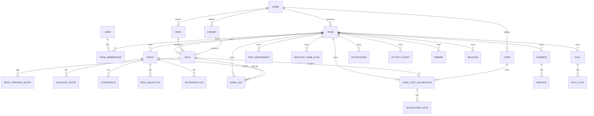

# Data Model

The conceptual data model for TeamBrewer. This is the shared reference for every feature spec and phase
plan. It is **conceptual, not a final Prisma schema** — field lists are indicative; the authoritative
schema evolves in the Prisma files as phases land, but it must stay consistent with the rules here.

Related: [multi-tenancy](multi-tenancy.md) · [game-abstraction](game-abstraction.md) ·
[ADR-0002 decks-as-links](../decisions/0002-decks-as-links.md) ·
[ADR-0005 confidence-weight-model](../decisions/0005-confidence-weight-model.md) ·
[ADR-0008 multi-tenant-teams](../decisions/0008-multi-tenant-teams.md).

## Golden rules

1. **Every team-owned row has a non-null `teamId`.** Global reference data (users, cards, games catalog)
   does not. See the table below for which is which.
2. **IDs** are opaque strings (CUID/UUID). **Timestamps** `createdAt` / `updatedAt` on every table.
3. **Soft-delete** (`archivedAt`) domain content rather than hard-deleting, so history/aggregates survive.
4. **Names are explicit** — `confidenceWeight`, not `cw`.
5. **Enums live where they belong:** cross-game enums in `packages/shared`; game-specific value sets
   (formats, identity/hero lists) come from the **game adapter**, not hard-coded in core.

## Global vs team-scoped

| Global (no `teamId`) | Team-scoped (has `teamId`) |
|---|---|
| `User`, `Session` | `Team`, `TeamMembership` (link tables — see note) |
| `Game` (the TCG catalog: FaB, Riftbound) | `Deck`, `Event`, `GauntletEntry` |
| `Card` (reference data, per game) | `GameLog`, `MatchupGamePlan`, `DeckSelection`, `Retrospective` |
| `Hero`/identity (reference data, per game) | `CardTestSuggestion`, `SuggestionVote`, `TestAssignment` |
| `Format` (reference data, per game) | `Comment`, `Mention`, `Notification`, `ActivityEvent` |
| | `Primer`, `Decision`, `Poll`, `PollVote` |

> Note: `Team` itself is the tenant root; `TeamMembership` carries `teamId` + `userId`. Users are global
> (one login, many teams).

## Entities (conceptual)

### Identity & tenancy
- **User** `{ id, name, displayName, isInstanceAdmin, passwordHash (via Better Auth), totpEnabled, ... }`
- **Team** `{ id, name, slug, gameId (→ Game), createdBy, ... }` — bound to exactly one game.
- **TeamMembership** `{ id, teamId, userId, role: 'team_admin' | 'member', joinedAt }`
- **Session** — managed by Better Auth; carries the authenticated user; **active team** is resolved
  per-request (see [multi-tenancy](multi-tenancy.md)).
- **InviteLink / SetupToken** `{ id, userId?, teamId?, tokenHash, purpose: 'setup' | 'reset', expiresAt, usedAt }`
  — single-use, hashed at rest. See [security](security.md).

### Game reference data (global, per game — owned by adapter)
- **Game** `{ id, key: 'flesh_and_blood' | 'riftbound', name }`
- **Format** `{ id, gameId, key, name, isConstructed, ... }` (e.g. CC, Blitz, LL, SAGE)
- **Hero** (a.k.a. identity) `{ id, gameId, name, classes[], talents[], startingLife?, ... }`
- **Card** `{ id, gameId, externalId (stable source id), name, pitch?, cost?, power?, defense?, types[],
  subtypes[], keywords[], text, rarity, imageUrl, formatLegality{}, sourceVersion, ... }`
  — FaB card identity is effectively **name + pitch**. Fields vary by game; the adapter maps source → this.

### Decks (link-only — see ADR-0002)
- **Deck** `{ id, teamId, name, gameId, formatId, heroId?, externalUrl, source, ownerId,
  status: 'exploratory' | 'testing' | 'tournament_ready' | 'retired', visibility: 'team' | 'private',
  isReference (gauntlet/opponent archetype vs our deck), tags[], notes, archivedAt? }`
- **DeckIterationEntry** `{ id, deckId, authorId, body (e.g. "-2 X, +2 Y after event"), createdAt }`
  — manual changelog; there is **no stored card list**.

### Events & gauntlets
- **Event** `{ id, teamId, name, formatId, date, location?, importance, description, status }`
- **GauntletEntry** `{ id, eventId, teamId, referenceDeckId (→ Deck isReference) or heroId/archetypeLabel,
  expectedMetaShare (0–100), notes }`
- **Attendance** `{ id, eventId, userId, status: 'going' | 'maybe' | 'not_going' }`
- **DeckSelection** `{ id, eventId, userId, deckId, locked, lockedAt?, reasoning }`
- **Retrospective** `{ id, eventId, teamId, authorId, body, resultsSummary, learnings }`

### Game logging & matchups
- **GameLog** `{ id, teamId, loggedById, formatId, eventId?, playedAt,
  sideA: { pilotUserId, deckId },
  sideB: { pilotUserId? | externalOpponentName?, deckId? | heroId? | archetypeLabel? },
  onThePlaySide, bestOf, result (games won A / B or single-game win/loss/draw),
  winType?, lossReason?, learnings,
  confidenceFactors: { skillParity, seriousness, deckMaturity, pilotFamiliarity } (each an enum),
  confidenceWeight (0–1, derived) }`
  — see [ADR-0005](../decisions/0005-confidence-weight-model.md) for the factor→weight formula.
- **Matchup** — *derived/aggregated*, not necessarily a stored table: for a `(deckA/heroA vs deckB/heroB,
  format, [event])` pairing, compute weighted win rate `Σ(wᵢ·winᵢ)/Σ(wᵢ)`, raw N, effective sample
  `Σ(wᵢ)`, trust indicator. May be materialized for performance later; source of truth is `GameLog`.

### Testing queue
- **CardTestSuggestion** `{ id, teamId, deckId, authorId, cardInId (→ Card), cardOutId? (→ Card),
  reasoning, status: 'proposed' | 'testing' | 'adopted' | 'rejected', resolutionNote }`
- **SuggestionVote** `{ id, suggestionId, userId, value (up/down or reaction) }`
- **TestAssignment** `{ id, teamId, eventId?, assigneeId, assignedById, deckId (ours),
  opponentRef (gauntletEntryId | heroId | archetypeLabel), targetGames?, status, notes }`

### Game-plans
- **MatchupGamePlan** `{ id, teamId, ourDeckId, opponentRef (gauntletEntryId | heroId | archetypeLabel),
  formatId, body, keyCards[] (→ Card), updatedBy }`

### Collaboration (polymorphic — see collaboration-core spec)
- **Comment** `{ id, teamId, authorId, subjectType, subjectId, body, parentCommentId?, archivedAt? }`
- **Mention** `{ id, commentId, mentionedUserId }`
- **Notification** `{ id, teamId, userId, type, subjectType, subjectId, readAt? }`
- **ActivityEvent** `{ id, teamId, actorId, verb, subjectType, subjectId, createdAt }`

### Team knowledge
- **Primer** `{ id, teamId, authorId, title, kind: 'deck_primer' | 'matchup' | 'format_notes' | 'other',
  relatedDeckId?, body (markdown), visibility, archivedAt? }`
- **Decision** `{ id, teamId, authorId, title, context, decision, rationale, relatedSubjectRef?, decidedAt }`
- **Poll** `{ id, teamId, authorId, question, options[], closesAt?, status }`
- **PollVote** `{ id, pollId, userId, optionId }`

## ERD (conceptual)

## Indexing & integrity notes
- Composite indexes on `(teamId, ...)` for all team-scoped queries.
- `TeamMembership` unique on `(teamId, userId)`.
- `Card` unique on `(gameId, externalId)`; searchable index on `(gameId, name)`.
- Foreign keys must respect tenancy: a `GameLog.deckId` must belong to the same `teamId` — enforce in the
  service layer and cover with isolation tests (see [testing-strategy](testing-strategy.md)).
