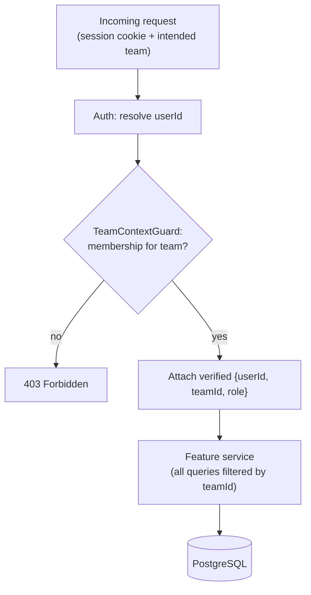

# Multi-Tenancy & Team Isolation

TeamBrewer hosts **multiple isolated teams (workspaces)** on one instance. A team **never** sees another
team's data. This is a **security property**, not merely a UI filter. Formal decision:
[ADR-0008](../decisions/0008-multi-tenant-teams.md).

## Model

- **User** — global (one login), may belong to many teams.
- **Team** — a workspace bound to **one game** (e.g. *Rosette* = Flesh and Blood).
- **TeamMembership** — `(userId, teamId, role)`; role is `team_admin` or `member`.
- **Instance-admin** — a global super-admin (`User.isInstanceAdmin`) who creates teams and invites people.
- **Active team** — the single team a user is currently viewing. The UI shows one team at a time; it
  **never merges** teams.
- Every team-owned row carries a non-null **`teamId`** (see [data-model](data-model.md)).

## Roles & capabilities

| Capability | Instance-admin | Team-admin | Member |
|---|---|---|---|
| Create/delete teams | ✅ | ❌ | ❌ |
| Create users / generate setup links | ✅ | ✅ (within own team) | ❌ |
| Manage team membership & roles | ✅ | ✅ (own team) | ❌ |
| Create/edit own decks, log games, comment, suggest | ✅ | ✅ | ✅ |
| Manage events, gauntlets, assignments | ✅ | ✅ | create/edit own; admin can manage all |
| Edit/delete others' content | ✅ | ✅ (moderation, own team) | ❌ |

Ownership: a member controls their own decks/logs/suggestions; team-admins can moderate. Exact per-action
rules live in each feature spec.

## Enforcement (the core of the design)

**Trust the session, never the client.** The active team must be **verified against the user's
memberships** on every request — a client-supplied `teamId` is only ever accepted if the authenticated
user is a member of it.

Recommended mechanism (finalize in phase-01):

1. **Authenticated session** (Better Auth) resolves `userId`.
2. **Active team resolution:** the client indicates the intended team via the **`X-Team-Id` request
   header** (the convention locked in phase-01; see [api-conventions](api-conventions.md)). A
   **`TeamContextGuard`** loads the user's `TeamMembership` for that team; if none, it returns **403**. It
   attaches a verified `{ userId, teamId, role }` to the request context.
3. **Scoped data access:** feature services **must** filter every query by the request's `teamId`.
   Provide a thin, mandatory data-access helper (e.g. a request-scoped Prisma wrapper or a repository base
   class) that injects `teamId` so it's hard to forget. Cross-team foreign keys (e.g. a `GameLog`
   referencing a `Deck`) are validated to share the same `teamId`.
4. **Writes** stamp `teamId` from the request context, never from the request body.

## Frontend

- An **active-team context** holds the current team; a **team selector** switches it (only teams the user
  belongs to). Switching **reloads** scoped data (invalidate TanStack Query caches keyed by team).
- All API calls carry the active team indicator. **Query keys include `teamId`** so caches never bleed
  between teams.
- The UI never renders data from two teams simultaneously.

## Global (non-scoped) data

- **Card / Hero / Format / Game** are global reference data per game. A team reads only **its game's**
  reference data (filter by the team's `gameId`). This is not tenant data, so no `teamId`, but it **is**
  game-filtered.

## Testing (mandatory)

Tenant isolation must be covered by explicit tests in every module that owns team data:
- A user in team A **cannot** read/write team B's rows (expect 403/empty), even with a forged `teamId`.
- Cross-team foreign-key attempts are rejected.
- Query keys/caches on the frontend are team-scoped.

See [testing-strategy](testing-strategy.md) and the `phase-01-auth-and-tenancy` plan, which establishes
this backbone before any team-owned feature is built.
