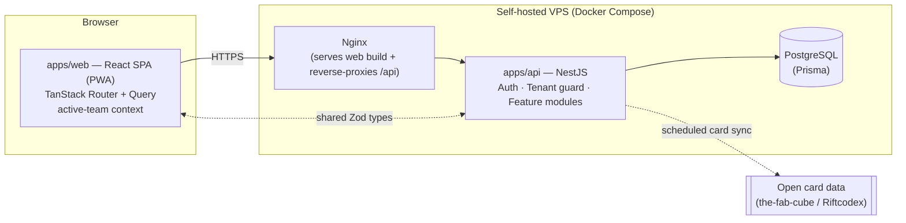
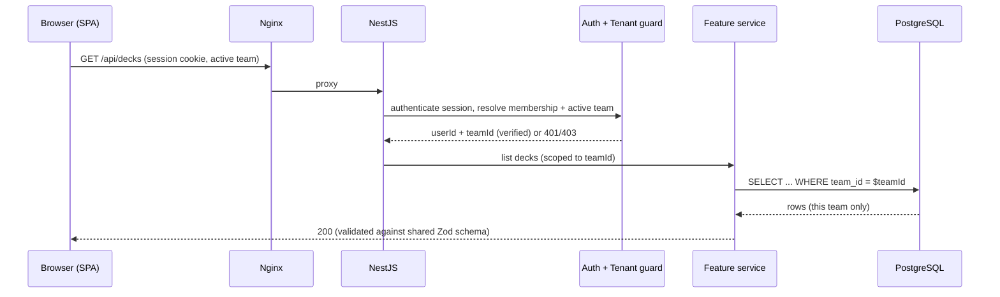

# Architecture Overview

TeamBrewer is a **self-hosted, multi-tenant web app**: a React SPA talking to a NestJS API over a
PostgreSQL database, deployed as containers behind Nginx. It is built as a **pnpm monorepo** with a
shared package so types and validation never drift between frontend and backend.

See also: [tech-stack](tech-stack.md) · [data-model](data-model.md) · [multi-tenancy](multi-tenancy.md) ·
[api-conventions](api-conventions.md) · [security](security.md) · [frontend](frontend.md) ·
[game-abstraction](game-abstraction.md) · [testing-strategy](testing-strategy.md).

## Monorepo layout (created in phase-00)

```
apps/
  web/        # React + Vite SPA (PWA). Consumes the API. Static build served by Nginx.
  api/        # NestJS backend. REST API, auth, tenant scoping, business logic, Prisma access.
packages/
  shared/     # Zod schemas + inferred TypeScript types + shared constants, imported by web AND api.
docs/         # Knowledge base (source of truth).
.claude/      # Rules, skills, settings for agents.
docker-compose.yml
```

## High-level component diagram



## Design principles

1. **Modular by feature.** Each feature module (see [feature specs](../features/)) is a self-contained
   NestJS module (controller + service + Prisma access + DTOs) on the backend and a matching feature
   folder on the frontend. Small, focused units with clear interfaces. See the
   [`adding-a-feature-module`](../../.claude/skills/adding-a-feature-module/SKILL.md) skill.
2. **Tenant isolation is structural.** A single guard/interceptor enforces `teamId` scoping for every
   request from the authenticated session. Feature code cannot accidentally leak across teams. See
   [multi-tenancy](multi-tenancy.md).
3. **Game-agnostic core, per-game adapters.** FaB-specific knowledge (identity terms, formats, card
   schema) lives behind a `GameAdapter` interface. See [game-abstraction](game-abstraction.md).
4. **One contract, two consumers.** Request/response shapes are Zod schemas in `packages/shared`; the API
   validates against them and the web infers types from them. See [api-conventions](api-conventions.md).
5. **Readable over clever.** Explicit names, focused files, no premature abstraction. When a file grows
   too large, split it — it's doing too much.
6. **Well tested.** Every module ships unit + integration tests, plus tenant-isolation tests; critical
   flows get e2e coverage. See [testing-strategy](testing-strategy.md).

## Request lifecycle (typical authenticated call)



## Deployment

Docker Compose runs three services: **PostgreSQL**, the **NestJS API**, and **Nginx** (serving the web
build and reverse-proxying `/api`). Designed to run on a single modest VPS. Details in
[security](security.md) and phase plans (`phase-00`, `phase-13`).
