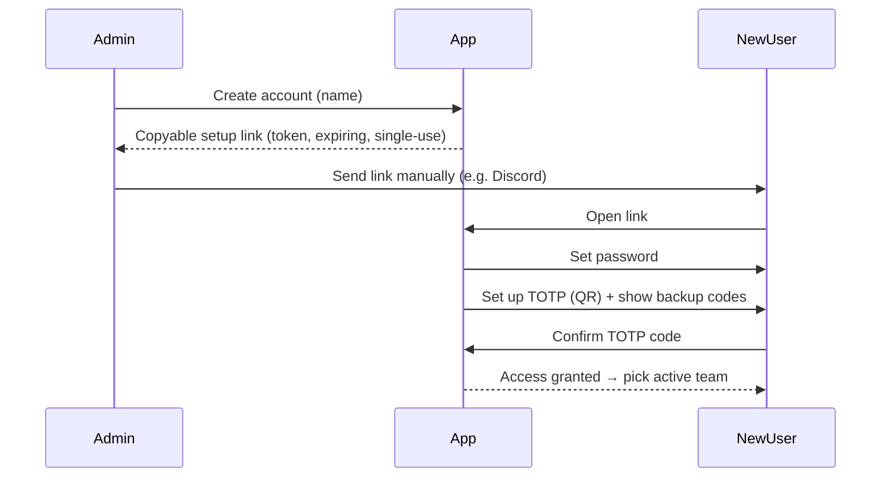

# Security

TeamBrewer is private and self-hosted. Security priorities: **strict access control**, **strong
authentication (mandatory 2FA)**, and **tenant isolation**. Related:
[multi-tenancy](multi-tenancy.md) · [ADR-0003 no-email-auth](../decisions/0003-no-email-auth.md).

## Access model

- **No open signup.** Accounts are created only by an instance-admin or a team-admin.
- **Roles:** instance-admin (global), team-admin (per team), member (per team). See
  [multi-tenancy](multi-tenancy.md).
- **Tenant isolation is a security boundary**, enforced server-side on every request.

## Authentication (Better Auth)

An account is provisioned with **password + TOTP 2FA** or **Discord SSO** (`authMethod`), chosen at
provisioning — see [ADR-0009](../decisions/0009-discord-authentication.md):

- **Password + TOTP 2FA (`password_totp`)** — TOTP is **mandatory**; a user cannot reach app data until
  TOTP is set up. Backup codes are generated at setup and shown once.
- **Discord SSO (`discord`)** — sign in with Discord (OAuth2, `identify` scope only, `state` for CSRF).
  **Two-factor is delegated to Discord** for these accounts (we cannot enforce it) — a **known, accepted
  tradeoff** (ADR-0009). We surface a recommendation to enable Discord 2FA. Only **admin-provisioned**
  accounts can log in via Discord (no auto-provisioning) — invite-only is preserved.

A password account may additionally link Discord for login (ADR-0011); that path's 2FA is delegated to
Discord.

Other properties:
- **Discord link (password accounts):** a password account MAY link Discord for recognizability /
  @mention mapping and, as of [ADR-0011](../decisions/0011-discord-additional-login-method.md), to also
  sign in with Discord.
- **Sessions:** secure, httpOnly, sameSite cookies; reasonable expiry + rotation; server-side session
  revocation (admin can revoke).
- **Password storage:** handled by Better Auth (strong hashing). We never store plaintext or handle raw
  card/financial data.
- **Discord app config:** `DISCORD_CLIENT_ID`, `DISCORD_CLIENT_SECRET`, and a redirect URI are secrets/config
  (env / Docker secrets), introducing an external login dependency for Discord accounts.

## The no-email onboarding & recovery flow

We deliberately run **without an email server** (see [ADR-0003](../decisions/0003-no-email-auth.md)).
Instead, admins generate **single-use, expiring links** and share them manually (e.g. Discord DM).

- **Setup link** (new user): admin creates the account → app generates a link containing a
  cryptographically random token → admin copies and sends it → user opens it, sets a password, sets up
  TOTP, and saves backup codes.
- **Reset link** (forgot password): admin generates a reset link the same way. (There is no self-service
  email reset.) A user who still has TOTP + backup codes but forgot their password needs an admin reset;
  a user who lost their TOTP device uses a **backup code**, or an admin resets 2FA.
- **Discord account (provisioning):** for an account whose `authMethod` is `discord`, the admin either
  pre-binds the user's Discord ID or issues a single-use **Discord claim link** (`purpose: 'discord_link'`,
  shared manually, no email) that binds the user's Discord identity on first authorization. Thereafter the
  user signs in with Discord. No matching provisioned account → login rejected (invite-only preserved).
- **Token handling:** store only a **hash** of the token; single-use (`usedAt`); short expiry;
  invalidated on use or when a newer link is issued. Rate-limit link generation and consumption.

## Application hardening

- **Input validation** everywhere via shared Zod schemas ([api-conventions](api-conventions.md)).
- **AuthZ on every endpoint** (authenticated + role + tenant). Default-deny.
- **CSRF protection** for cookie-based auth is layered: session cookies are `SameSite` + `httpOnly`,
  **CORS** is locked to the app origin (`WEB_ORIGIN`), and an `OriginCheckGuard` rejects any
  **state-changing** (POST/PUT/PATCH/DELETE) request that carries a session cookie but whose `Origin`
  (or `Referer` fallback) is not the app origin. Better Auth's own `/api/auth/*` routes ship their own
  origin/CSRF protection. Requests without a session cookie are not CSRF-exploitable and are left to the
  auth guards.
- **Rate limiting** (all thresholds env-configurable — see `.env.example` `RATE_LIMIT_*`):
  - Better Auth's own limiter guards `/api/auth/*` (login/TOTP), with a strict per-window cap on the
    sign-in paths to blunt brute-forcing (`RATE_LIMIT_AUTH_*`).
  - The Nest throttler guards everything else: a generous global default, a **strict** limit on link
    generation + consumption and Discord OAuth start, and a tuned **expensive-operation** limit on the
    matchup matrix/coverage reads and the admin card-data sync.
- **Security headers** are set at two layers: **Nginx** (the edge) owns the SPA's **CSP** and, at the
  TLS-terminating front proxy, **HSTS**; the **API** additionally sets `X-Content-Type-Options`,
  `X-Frame-Options: DENY`, and `Referrer-Policy` via **helmet** (API CSP/HSTS are disabled there to avoid
  drift — the API serves JSON only). The document CSP keeps **`connect-src 'self'`** (app code can't
  exfiltrate off-origin); card art comes from external HTTPS CDNs, so `img-src` allows `https:`. The PWA
  **service worker** re-fetches cross-origin card images with `fetch()`, which CSP validates against
  `connect-src` — not `img-src` — so **`/sw.js` alone is served with a widened `connect-src 'self' https:`**
  (a service worker's CSP is that of its own script response). This scopes the broad connect grant to the
  SW's caching fetches; without it Firefox blocks the SW fetch with `NS_ERROR_INTERCEPTION_FAILED` and card
  images never render.
- **Secrets** via environment variables / Docker secrets; never committed. `.env.example` documents them.
- **No secrets or PII in logs.** Tenant-violation attempts are logged for audit with **opaque IDs only**:
  the `TeamContextGuard`/`TeamAdminGuard` log a forged-team (non-member) access as a warning, and the
  `OriginCheckGuard` logs rejected cross-origin mutations. Cross-tenant resource reads deliberately return
  **404 without a distinct log** to avoid confirming existence (enumeration-safety) — the forged active-team
  is the logged signal.
- **Dependencies:** keep updated; run dependency audits locally (`pnpm audit`), and in CI once a remote is configured.
- **Prohibited data:** TeamBrewer never collects payment/financial data, government IDs, or similar.

## Tenant isolation (security-critical)

See [multi-tenancy](multi-tenancy.md). Summary: active team is verified against memberships; all queries
are `teamId`-scoped; cross-tenant reads return 404; every team-owning module has isolation tests.

## Self-hosting notes

- TLS terminated at Nginx (Let's Encrypt). App assumes HTTPS.
- PostgreSQL not exposed publicly; only the API reaches it (Docker network).
- Documented **backup/restore** for the database (phase-13). Backups contain all tenants — protect them.
- Principle of least privilege for the DB user.
