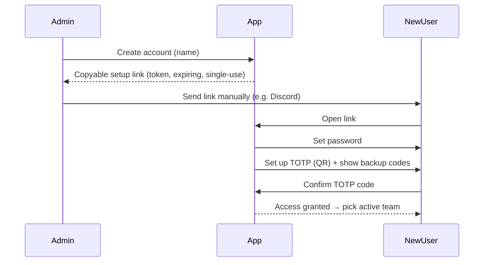

# Security

TeamBrewer is private and self-hosted. Security priorities: **strict access control**, **strong
authentication (mandatory 2FA)**, and **tenant isolation**. Related:
[multi-tenancy](multi-tenancy.md) · [ADR-0003 no-email-auth](../decisions/0003-no-email-auth.md).

## Access model

- **No open signup.** Accounts are created only by an instance-admin or a team-admin.
- **Roles:** instance-admin (global), team-admin (per team), member (per team). See
  [multi-tenancy](multi-tenancy.md).
- **Tenant isolation is a security boundary**, enforced server-side on every request.

## Authentication (Better Auth)

- **Password + mandatory TOTP 2FA.** A user cannot reach app data until TOTP is set up. Backup codes are
  generated at setup and shown once.
- **Sessions:** secure, httpOnly, sameSite cookies; reasonable expiry + rotation; server-side session
  revocation (admin can revoke).
- **Password storage:** handled by Better Auth (strong hashing). We never store plaintext or handle raw
  card/financial data.

## The no-email onboarding & recovery flow

We deliberately run **without an email server** (see [ADR-0003](../decisions/0003-no-email-auth.md)).
Instead, admins generate **single-use, expiring links** and share them manually (e.g. Discord DM).

- **Setup link** (new user): admin creates the account → app generates a link containing a
  cryptographically random token → admin copies and sends it → user opens it, sets a password, sets up
  TOTP, and saves backup codes.
- **Reset link** (forgot password): admin generates a reset link the same way. (There is no self-service
  email reset.) A user who still has TOTP + backup codes but forgot their password needs an admin reset;
  a user who lost their TOTP device uses a **backup code**, or an admin resets 2FA.
- **Token handling:** store only a **hash** of the token; single-use (`usedAt`); short expiry;
  invalidated on use or when a newer link is issued. Rate-limit link generation and consumption.

## Application hardening

- **Input validation** everywhere via shared Zod schemas ([api-conventions](api-conventions.md)).
- **AuthZ on every endpoint** (authenticated + role + tenant). Default-deny.
- **CSRF protection** for cookie-based auth; **CORS** locked to the app origin.
- **Rate limiting** on auth, link generation/consumption, and expensive endpoints.
- **Security headers** via Nginx/helmet (CSP, HSTS, X-Frame-Options, etc.).
- **Secrets** via environment variables / Docker secrets; never committed. `.env.example` documents them.
- **No secrets or PII in logs.** Log tenant-violation attempts (without sensitive data) for audit.
- **Dependencies:** keep updated; CI runs audits.
- **Prohibited data:** TeamBrewer never collects payment/financial data, government IDs, or similar.

## Tenant isolation (security-critical)

See [multi-tenancy](multi-tenancy.md). Summary: active team is verified against memberships; all queries
are `teamId`-scoped; cross-tenant reads return 404; every team-owning module has isolation tests.

## Self-hosting notes

- TLS terminated at Nginx (Let's Encrypt). App assumes HTTPS.
- PostgreSQL not exposed publicly; only the API reaches it (Docker network).
- Documented **backup/restore** for the database (phase-13). Backups contain all tenants — protect them.
- Principle of least privilege for the DB user.
