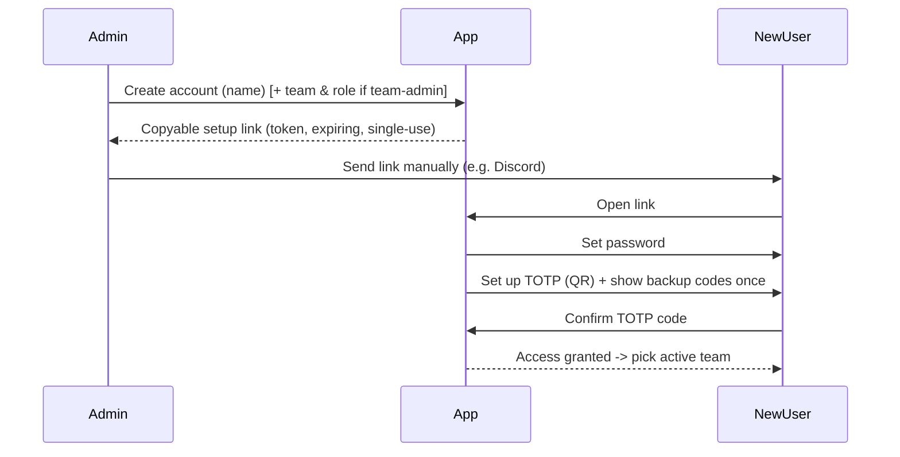

# Feature: Accounts & Auth

## Summary

Invite-only authentication with **no email server**: admins create accounts and hand out single-use,
expiring **setup** and **reset** links (copy-pasted manually, e.g. via Discord). Every user authenticates
with **password + mandatory TOTP 2FA** and holds one-time **backup codes** for lost-device recovery. Built
on Better Auth. See [ADR-0003](../decisions/0003-no-email-auth.md) and
[security](../architecture/security.md).

## Goals & value

- Keep the instance strictly private — **no open signup**, access is admin-granted only.
- Avoid running/maintaining an SMTP server and its deliverability headaches
  ([ADR-0003](../decisions/0003-no-email-auth.md)).
- Enforce strong account security (2FA is not optional) for a competitive team that guards its tech.
- Give admins a simple, in-the-loop onboarding and recovery workflow appropriate for a 10–30 person team.

## User stories

- As an **instance-admin**, I can create a user account and get a copyable **setup link** to send them.
- As a **team-admin**, I can create an account **for my own team** and generate its setup link.
- As a **new user**, I can open a setup link to set my password, set up TOTP, and save my backup codes.
- As a **member**, I can log in with my password and a TOTP code.
- As a **member** who lost my authenticator device, I can log in with a **backup code**.
- As a **member** who forgot my password, I can ask an admin for a **reset link** (there is no self-service
  email reset).
- As an **admin**, I can generate a reset link, reset a user's 2FA, and **revoke a user's sessions**.
- As a **user**, I can see my active sessions and sign out.

## Data

Uses global identity/tenancy entities from [data-model](../architecture/data-model.md#identity--tenancy):

- **User** `{ id, name, displayName, isInstanceAdmin, passwordHash (via Better Auth), totpEnabled, ... }`
- **Session** — managed by Better Auth (secure, httpOnly, sameSite cookie); active team resolved
  per-request (see [multi-tenancy](../architecture/multi-tenancy.md)).
- **InviteLink / SetupToken** `{ id, userId?, teamId?, tokenHash, purpose: 'setup' | 'reset', expiresAt,
  usedAt }` — **single-use, hashed at rest**, short expiry.
- Backup codes — generated at TOTP setup, stored hashed, each single-use.

Account creation is coupled to team membership; the membership side lives in
[teams-and-membership](teams-and-membership.md) (a **TeamMembership** with a role is created alongside the
account for a team-admin invite).

## Behavior & rules

### Account lifecycle & link flow

- **Setup link (new user):** admin creates the account -> app generates a cryptographically random token,
  storing only its **hash** -> admin copies and shares it. Opening it lets the user set a password, set up
  TOTP, and save backup codes. The user cannot reach any team data until TOTP is confirmed.
- **Reset link (forgot password):** admin generates a reset link the same way; the user sets a new
  password. TOTP is unaffected.
- **Lost TOTP device:** the user logs in with a **backup code**; or an admin **resets 2FA**, after which
  the user re-runs TOTP setup (a fresh set of backup codes is issued, invalidating the old set).
- **Token handling:** single-use (`usedAt` stamped on consumption), short expiry, invalidated when a newer
  link of the same purpose is issued for that user. Generation and consumption are **rate-limited**.

### Login

1. Password check (Better Auth). 2. TOTP code (or a backup code). Access to app data requires
`totpEnabled = true`. Failed attempts are rate-limited; tenant/auth violations are logged without PII.

### Permissions per role

| Action | Instance-admin | Team-admin | Member |
|---|---|---|---|
| Create user + generate setup link | ✅ (any team) | ✅ (own team only) | ❌ |
| Generate reset link for a user | ✅ | ✅ (own-team users) | ❌ |
| Reset a user's 2FA | ✅ | ✅ (own-team users) | ❌ |
| Revoke a user's sessions | ✅ | ✅ (own-team users) | ❌ |
| Set/clear `isInstanceAdmin` | ✅ | ❌ | ❌ |
| Set own password / manage own TOTP & backup codes | ✅ | ✅ | ✅ |

See the capability model in [multi-tenancy](../architecture/multi-tenancy.md#roles--capabilities).

### Validation rules

- Password strength enforced by Better Auth policy; validated via shared Zod schema.
- TOTP code must be a valid current window for the user's secret; backup code must be unused.
- Setup/reset endpoints reject expired, used, or unknown tokens with a generic message (no enumeration).

## API surface

Better Auth mounts its own handlers for sessions, TOTP enrolment/verification, and backup codes. Custom,
role-guarded admin endpoints follow [api-conventions](../architecture/api-conventions.md):

- `POST /api/admin/users` — create account (instance-admin, or team-admin for own team) -> returns the user
  and a fresh setup link.
- `POST /api/admin/users/:userId/setup-link` — regenerate a setup link.
- `POST /api/admin/users/:userId/reset-link` — generate a password reset link.
- `POST /api/admin/users/:userId/reset-2fa` — clear TOTP so the user re-enrolls.
- `DELETE /api/admin/users/:userId/sessions` — revoke all sessions for a user.
- `POST /api/auth/setup/:token` / `POST /api/auth/reset/:token` — consume a link (set password; setup flow
  then drives TOTP enrolment).
- `GET /api/me/sessions` / `DELETE /api/me/sessions/:sessionId` — self session management.

`teamId`, where relevant, comes from the verified request context, never the body.

## UI / UX

Mobile-first (see [frontend](../architecture/frontend.md#auth-ux)):

- **Setup-link landing page:** set password -> set up TOTP (scannable **QR** + manual secret) -> **show
  backup codes once** with a copy/download prompt -> done -> pick active team.
- **Login:** password -> TOTP, with a "use a backup code instead" affordance and clear "**ask your admin
  for a reset link**" messaging (no email flows shown).
- **Admin console:** create user, copy setup/reset link to clipboard, reset 2FA, revoke sessions.
- **Account settings:** change password, regenerate backup codes, view/sign-out sessions.

## Tenancy & permissions

`User` and `Session` are **global** (one login, many teams) — see
[data-model](../architecture/data-model.md#global-vs-team-scoped). A **team-admin's** account-creation and
recovery powers are scoped to their own team's users; the `TeamContextGuard`
([multi-tenancy](../architecture/multi-tenancy.md)) verifies the acting admin's role for the target team.
An instance-admin acts globally. Newly created accounts see only the teams they are made members of.

## Edge cases

- Expired / already-used / superseded token -> generic failure, no account-existence disclosure.
- User opens a setup link but abandons before confirming TOTP -> account remains un-onboarded; admin can
  regenerate the link.
- Backup codes exhausted -> user must regenerate (self-service in settings) or admin resets 2FA.
- Admin resets a user's password while the user has live sessions -> optionally revoke sessions.
- Team-admin attempts to create/recover a user outside their team -> 403.
- Two setup links issued -> only the latest is valid (older invalidated).
- Clock drift on TOTP -> accept a small window; backup code remains the fallback.

## Testing notes

Per [testing-strategy](../architecture/testing-strategy.md):

- **E2E:** setup-link -> set password -> TOTP -> land in team (the canonical onboarding journey).
- **Integration:** token is single-use and expires; hashed at rest; reset link changes only the password;
  reset-2fa forces re-enrolment and invalidates old backup codes; session revocation ends sessions.
- **AuthZ:** unauthenticated -> 401; member cannot hit admin endpoints -> 403; team-admin cannot
  create/recover users in another team -> 403 (**tenant-isolation** test).
- **Login:** cannot reach app data with `totpEnabled = false`; backup code works once; rate limiting on
  auth and link generation/consumption.
- **Validation:** password policy and Zod envelope errors.

## Out of scope

- **Transactional email / self-service email reset** — cut by [ADR-0003](../decisions/0003-no-email-auth.md)
  (possible future opt-in).
- **Public / open signup** — cut (see [feature-catalog](../product/feature-catalog.md#explicitly-cut-out-of-scope)).
- **Optional 2FA** — 2FA is mandatory.
- Per-team roles and the active-team selector are specified in [teams-and-membership](teams-and-membership.md).

## See also

- [ADR-0003: Invite-only auth without email; mandatory TOTP 2FA](../decisions/0003-no-email-auth.md)
- [Security](../architecture/security.md) · [Multi-tenancy](../architecture/multi-tenancy.md) ·
  [API conventions](../architecture/api-conventions.md) · [Frontend](../architecture/frontend.md)
- [Teams & membership](teams-and-membership.md)
- Implementing phase: [phase-01 Auth & Tenancy](../plans/phase-01-auth-and-tenancy.md)
