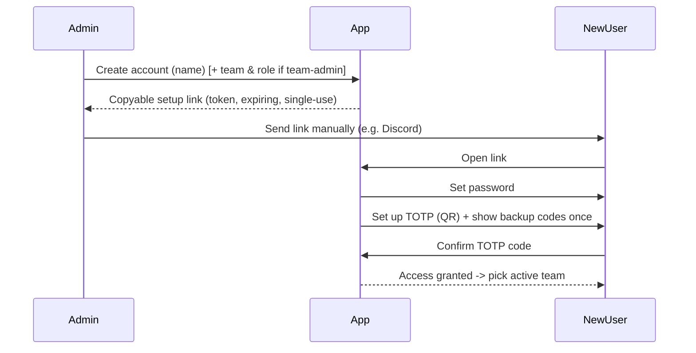

# Feature: Accounts & Auth

## Summary

Invite-only authentication with **no email server**. Accounts are provisioned at claim time with
**password + mandatory TOTP 2FA** (+ one-time backup codes) **or Discord SSO**; a password account may
**additionally link Discord to also sign in with it** (ADR-0011). Admins create accounts and hand out
single-use, expiring links (setup / reset / Discord-claim) copy-pasted manually (e.g. via Discord). Built
on Better Auth. See [ADR-0003](../decisions/0003-no-email-auth.md),
[ADR-0009](../decisions/0009-discord-authentication.md),
[ADR-0011](../decisions/0011-discord-additional-login-method.md), and
[security](../architecture/security.md).

## Goals & value

- Keep the instance strictly private — **no open signup**, access is admin-granted only.
- Avoid running/maintaining an SMTP server and its deliverability headaches
  ([ADR-0003](../decisions/0003-no-email-auth.md)).
- Enforce strong account security: **TOTP 2FA is mandatory for password accounts**. Discord SSO is offered
  as a convenient alternative for a Discord-native team, accepting that 2FA is delegated to Discord for
  those accounts (a recorded tradeoff — [ADR-0009](../decisions/0009-discord-authentication.md)).
- Give admins a simple, in-the-loop onboarding and recovery workflow appropriate for a 10–30 person team.

## User stories

- As an **admin**, when I create a user I do **not** pick their login method — I share one invite link and
  the invitee chooses password+TOTP or Discord when they claim it (updated 2026-07; see ADR-0009).
- As an **instance-admin**, I can create a user account and get a copyable **invite link** to send them.
- As a **team-admin**, I can create an account **for my own team** and generate its invite link.
- As an **invitee**, I open the invite link and choose to **set a password (then TOTP + backup codes)** or
  **connect Discord** — whichever I complete commits my account's login method.
- As an **admin**, I can **revoke** a user's outstanding invite link and **generate a new one** at any time.
- As a **new Discord user**, I can open a claim link, authorize with Discord once, and thereafter **log in
  with Discord**.
- As a **member**, I can log in with my password + TOTP code, or with Discord if my account supports it
  (a Discord-provisioned account, or a password account with Discord linked — ADR-0011).
- As a **password member** who lost my authenticator device, I can log in with a **backup code**.
- As a **password member**, I can optionally **link my Discord to also sign in with it** (and for
  identity/@mentions). See [ADR-0011](../decisions/0011-discord-additional-login-method.md).
- As a **member** who forgot my password, I can ask an admin for a **reset link** (there is no self-service
  email reset).
- As an **admin**, I can generate a reset link, reset a user's 2FA, and **revoke a user's sessions**.
- As a **user**, I can see my active sessions and sign out.

## Data

Uses global identity/tenancy entities from [data-model](../architecture/data-model.md#identity--tenancy):

- **User** `{ id, name, displayName, isInstanceAdmin, authMethod: 'password_totp' | 'discord',
  passwordHash? , totpEnabled?, discordUserId?, discordUsername?, ... }` — a `password_totp` user may
  **add** Discord as an additional login method (ADR-0011); login capability is read from the Better
  Auth `account` table, not `authMethod`.
- **Session** — managed by Better Auth (secure, httpOnly, sameSite cookie); active team resolved
  per-request (see [multi-tenancy](../architecture/multi-tenancy.md)).
- **InviteLink / SetupToken** `{ id, userId?, teamId?, tokenHash, purpose: 'setup' | 'reset' | 'discord_link',
  expiresAt, usedAt }` — **single-use, hashed at rest**, short expiry.
- Backup codes — generated at TOTP setup (password accounts), stored hashed, each single-use.

Account creation is coupled to team membership; the membership side lives in
[teams-and-membership](teams-and-membership.md) (a **TeamMembership** with a role is created alongside the
account for a team-admin invite).

## Behavior & rules

### Account lifecycle & link flow

- **Setup link (new user):** admin creates the account -> app generates a cryptographically random token,
  storing only its **hash** -> admin copies and shares it. Opening it lets the user set a password, set up
  TOTP, and save backup codes. The user cannot reach any team data until TOTP is confirmed.
- **Reset link (forgot password):** admin generates a reset link the same way; the user sets a new
  password. TOTP is unaffected. (Password accounts only.)
- **Discord account (provisioning):** the admin sets the account's `authMethod` to `discord` and either
  pre-binds the user's Discord ID or issues a single-use **Discord claim link** (`purpose: 'discord_link'`).
  Opening it runs Discord OAuth (`identify` scope, `state` for CSRF) once and binds the user's Discord
  identity to the account. No email; invite-only preserved — a Discord login with **no matching provisioned
  account is rejected** (no auto-provisioning). See [ADR-0009](../decisions/0009-discord-authentication.md).
- **Provisioned method is admin-changeable:** an account is provisioned as password+TOTP **or** Discord.
  Switching the provisioned method is an admin action (e.g. issue a setup link to convert a Discord
  account to password+TOTP, or a claim link for the reverse). Discord-login accounts cannot add a
  password themselves (out of scope, ADR-0011).
- **Discord link (password accounts):** a password user may link Discord in settings for recognizability
  / @mention mapping, which — as of [ADR-0011](../decisions/0011-discord-additional-login-method.md) —
  also enables signing in with that linked Discord account; unlinking revokes the login capability.
- **Lost TOTP device:** the user logs in with a **backup code**; or an admin **resets 2FA**, after which
  the user re-runs TOTP setup (a fresh set of backup codes is issued, invalidating the old set).
- **Token handling:** single-use (`usedAt` stamped on consumption), short expiry, invalidated when a newer
  link of the same purpose is issued for that user. Generation and consumption are **rate-limited**.

### Login

- **Password accounts:** 1. password check (Better Auth); 2. TOTP code (or a backup code). Access to app
  data requires `totpEnabled = true`.
- **Discord accounts, and password accounts with Discord linked:** "Log in with Discord" → OAuth
  (`identify`, `state`). The returned Discord ID must match a provisioned account (or a password account's
  linked `discord` account row, per [ADR-0011](../decisions/0011-discord-additional-login-method.md)),
  else login is rejected. No app-side TOTP step (2FA is Discord's).

Failed attempts are rate-limited; tenant/auth violations are logged without PII.

### Permissions per role

| Action | Instance-admin | Team-admin | Member |
|---|---|---|---|
| Create user + generate/revoke invite link (invitee chooses method) | ✅ (any team) | ✅ (own team only) | ❌ |
| Change a user's login method (re-issue an invite link) | ✅ | ✅ (own-team users) | ❌ |
| Generate reset link for a user | ✅ | ✅ (own-team users) | ❌ |
| Reset a user's 2FA | ✅ | ✅ (own-team users) | ❌ |
| Revoke a user's sessions | ✅ | ✅ (own-team users) | ❌ |
| Set/clear `isInstanceAdmin` | ✅ | ❌ | ❌ |
| Set own password / manage own TOTP & backup codes (password accounts) | ✅ | ✅ | ✅ |
| Link/unlink own Discord (password accounts, identity + optional Discord login) | ✅ | ✅ | ✅ |

See the capability model in [multi-tenancy](../architecture/multi-tenancy.md#roles--capabilities).

### Validation rules

- Password strength enforced by Better Auth policy; validated via shared Zod schema.
- TOTP code must be a valid current window for the user's secret; backup code must be unused.
- Setup/reset endpoints reject expired, used, or unknown tokens with a generic message (no enumeration).

## API surface

Better Auth mounts its own handlers for sessions, TOTP enrolment/verification, and backup codes. Custom,
role-guarded admin endpoints follow [api-conventions](../architecture/api-conventions.md):

Admin account routes are **path-scoped by team** (phase-01 "Option C"): the target team is the `:teamId`
path segment, authorized by `TeamAdminGuard` (instance-admin, or the team's own team-admin), and each
per-user action asserts the target is a member of that team.

- `POST /api/admin/teams/:teamId/users` — create account with `authMethod` + membership `role`
  -> returns the user and a fresh **setup link** (password) or **Discord claim link** (discord).
- `POST /api/admin/teams/:teamId/users/:userId/setup-link` — regenerate a setup link (or convert to password+TOTP).
- `POST /api/admin/teams/:teamId/users/:userId/discord-claim-link` — generate a Discord claim link (or convert to Discord).
- `POST /api/admin/teams/:teamId/users/:userId/reset-link` — generate a password reset link (password accounts).
- `POST /api/admin/teams/:teamId/users/:userId/reset-2fa` — clear TOTP so the user re-enrolls (password accounts).
- `DELETE /api/admin/teams/:teamId/users/:userId/sessions` — revoke all sessions for a user.
- `PATCH /api/admin/users/:userId` — set/clear the global `isInstanceAdmin` flag (instance-admin only).
- `POST /api/auth/setup/:token` / `POST /api/auth/reset/:token` — consume a link (set password; setup flow
  then drives TOTP enrolment).
- **Discord OAuth** (via Better Auth social provider): start + callback handlers for the login flow and for
  consuming a `discord_link` claim token (binds the returned Discord ID to the provisioned account).
- `POST /api/me/discord/link` / `DELETE /api/me/discord/link` — link/unlink Discord for a password
  account; linking gives identity + optional Discord login (ADR-0011), unlinking revokes the login
  capability.
- `GET /api/me/sessions` / `DELETE /api/me/sessions/:sessionId` — self session management.

`teamId`, where relevant, comes from the verified request context, never the body.

## UI / UX

Mobile-first (see [frontend](../architecture/frontend.md#auth-ux)):

- **Setup-link landing page** (password): set password -> set up TOTP (scannable **QR** + manual secret) ->
  **show backup codes once** with a copy/download prompt -> done -> pick active team.
- **Discord claim-link landing page:** "Authorize with Discord" -> OAuth -> binds identity -> done -> pick
  active team.
- **Login:** offers **password + TOTP** (with a "use a backup code instead" affordance and "**ask your
  admin for a reset link**" messaging) and a **"Log in with Discord"** button; no email flows shown.
- **Admin console:** create user (**invitee chooses method**), copy invite / reset link to clipboard,
  **revoke** the invite link, generate a new one, reset 2FA, revoke sessions.
- **Account settings:** (password accounts) change password, regenerate backup codes, **link/unlink Discord
  identity**; view/sign-out sessions.

## Tenancy & permissions

`User` and `Session` are **global** (one login, many teams) — see
[data-model](../architecture/data-model.md#global-vs-team-scoped). A **team-admin's** account-creation and
recovery powers are scoped to their own team's users; the `TeamContextGuard`
([multi-tenancy](../architecture/multi-tenancy.md)) verifies the acting admin's role for the target team.
An instance-admin acts globally. Newly created accounts see only the teams they are made members of.

## Edge cases

- Expired / already-used / superseded token -> generic failure, no account-existence disclosure.
- User opens a setup link but abandons before confirming TOTP -> account remains un-onboarded; admin can
  regenerate the link.
- Backup codes exhausted -> user must regenerate (self-service in settings) or admin resets 2FA.
- Admin resets a user's password while the user has live sessions -> optionally revoke sessions.
- Team-admin attempts to create/recover a user outside their team -> 403.
- Two setup links issued -> only the latest is valid (older invalidated).
- Clock drift on TOTP -> accept a small window; backup code remains the fallback.
- **Discord login with no matching provisioned account** -> rejected (no auto-provisioning; invite-only).
- **Discord claim opened but OAuth denied/abandoned** -> account stays un-onboarded; admin can regenerate.
- **Discord ID already bound to another account** -> reject (`discordUserId` is unique).
- **Wrong method attempted** (password/reset flow on a Discord-provisioned account, or Discord login on a
  password account that has **not** linked Discord) -> rejected with guidance to use the account's
  actual method.

## Testing notes

Per [testing-strategy](../architecture/testing-strategy.md):

- **E2E:** setup-link -> set password -> TOTP -> land in team (the canonical onboarding journey).
- **Integration:** token is single-use and expires; hashed at rest; reset link changes only the password;
  reset-2fa forces re-enrolment and invalidates old backup codes; session revocation ends sessions.
- **AuthZ:** unauthenticated -> 401; member cannot hit admin endpoints -> 403; team-admin cannot
  create/recover users in another team -> 403 (**tenant-isolation** test).
- **Login (password):** cannot reach app data with `totpEnabled = false`; backup code works once; rate
  limiting on auth and link generation/consumption.
- **Login (Discord):** a provisioned Discord account logs in via OAuth; an **unprovisioned Discord identity
  is rejected** (invite-only); `discordUserId` is unique.
- **Login capability:** a password account with **no** Discord linked cannot log in via Discord; a
  Discord-provisioned account cannot log in via password; a password account with Discord **linked**
  logs in via either method (ADR-0011); unlinking revokes the Discord login path.
- **Validation:** password policy and Zod envelope errors; OAuth `state` mismatch rejected.

## Out of scope

- **Transactional email / self-service email reset** — cut by [ADR-0003](../decisions/0003-no-email-auth.md)
  (possible future opt-in).
- **Public / open signup** — cut; Discord login does **not** auto-provision accounts.
- **Discord bot-delivered links** — not now; a possible future convenience ([ADR-0009](../decisions/0009-discord-authentication.md)).
- **Discord accounts adding a password** — the reverse of [ADR-0011](../decisions/0011-discord-additional-login-method.md) is out of scope; only password → Discord is supported.
- **App-enforced 2FA for Discord accounts** — out of our control by design; 2FA is delegated to Discord for
  those accounts (mandatory TOTP applies to **password** accounts). See [ADR-0009](../decisions/0009-discord-authentication.md).
- Per-team roles and the active-team selector are specified in [teams-and-membership](teams-and-membership.md).

## See also

- [ADR-0003: Invite-only auth without email; mandatory TOTP 2FA](../decisions/0003-no-email-auth.md)
- [ADR-0009: Discord as an alternative authentication method](../decisions/0009-discord-authentication.md)
- [ADR-0011: Password accounts may add Discord as an additional login method](../decisions/0011-discord-additional-login-method.md)
- [Security](../architecture/security.md) · [Multi-tenancy](../architecture/multi-tenancy.md) ·
  [API conventions](../architecture/api-conventions.md) · [Frontend](../architecture/frontend.md)
- [Teams & membership](teams-and-membership.md)
- Implementing phase: [phase-01 Auth & Tenancy](../plans/phase-01-auth-and-tenancy.md)
