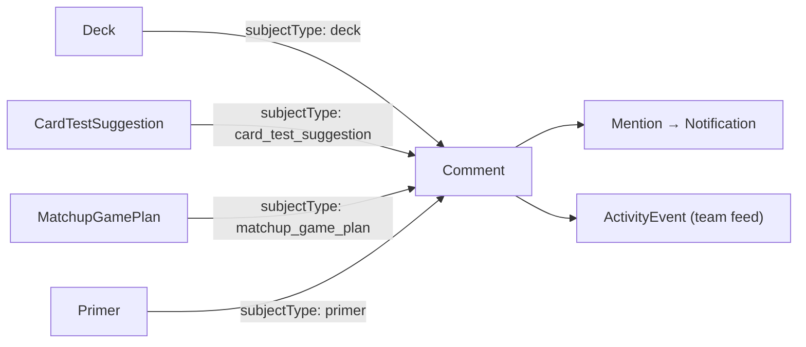

# Feature: Collaboration Core

## Summary

A **shared, polymorphic subsystem** that every other module attaches to for discussion and awareness:
threaded **comments**, **@mentions**, a team **activity feed**, and an in-app **notification center**.
Communication is the single biggest differentiator for successful teams and the place they most often fail
([playtesting-methodology.md §5](../domain/playtesting-methodology.md)) — so this is built **early
(phase-04)** and retrofitted onto decks first, then reused by suggestions, game-plans, primers, events,
and more. **All notifications are in-app only — there is no email** (the instance is invite-only with no
email; see [README](../README.md)).

## Goals & value

- Keep conclusions from getting lost in chat: discussion lives **on the thing being discussed**.
- One reusable mechanism instead of per-module comment tables — any module gains discussion by declaring a
  `subjectType`.
- Directed awareness via @mentions and a notification center, plus ambient awareness via the activity feed.

## User stories

- As a member, I comment on a card-test suggestion and reply to a teammate in a thread.
- As a member, I @mention a teammate to pull them into a decision; they see it in their notification center.
- As a theorist, I open the activity feed to catch up on what changed across the team since yesterday.
- As a member, I see an unread badge and clear my notifications as I read them.

## How any module attaches (the polymorphic contract)

A subject is addressed by `(subjectType, subjectId)`. To make a module commentable, it declares a
`subjectType` string and renders the shared comment thread + activity for that subject. No schema change to
the collaboration tables is needed.

| Module | `subjectType` (indicative) |
|---|---|
| Decks | `deck` |
| Card-test suggestions | `card_test_suggestion` |
| Game-plans | `matchup_game_plan` |
| Primers | `primer` |
| Decisions log | `decision` |
| Events | `event` |
| Game logs | `game_log` |

The set of valid `subjectType` values is a shared enum in `packages/shared`, extended as modules adopt the
subsystem. **Decks are the first adopter** in phase-04.



## Data

Exact entities from [data-model.md](../architecture/data-model.md) (all team-scoped, non-null `teamId`).

- **`Comment`** `{ id, teamId, authorId, subjectType, subjectId, body, parentCommentId?, archivedAt? }`
  — polymorphic; `parentCommentId` gives one level of threading (a reply points at a top-level comment).
- **`Mention`** `{ id, commentId, mentionedUserId }` — parsed from `@` tokens in `body`; each produces a
  `Notification` for the mentioned user.
- **`Notification`** `{ id, teamId, userId, type, subjectType, subjectId, readAt? }` — the recipient's
  in-app inbox item; `readAt` null = unread. Links back to the subject.
- **`ActivityEvent`** `{ id, teamId, actorId, verb, subjectType, subjectId, createdAt }` — the team feed
  (e.g. actor *commented on* a deck, *adopted* a suggestion). Produced by modules as meaningful things
  happen, using the same polymorphic address.

## Behavior & rules

- **Comment creation:** stamps `authorId` and `teamId` from context; the subject must exist and belong to
  the same team. On save, `@handle` tokens resolve to team members → `Mention` rows → `Notification`s.
- **Threading:** a reply sets `parentCommentId` to a top-level comment (single-level threads; replies to
  replies attach to the same parent).
- **Editing/deleting:** authors may edit/soft-delete (`archivedAt`) their own comments; team-admins may
  moderate any. Soft-deleted comments keep thread structure (shown as removed).
- **Mentions:** only resolve to **members of the same team**; an `@` for a non-member or another team's
  user does not create a notification.
- **Notifications:** generated for mentions and (optionally, per type) for replies to your comment or
  activity on subjects you authored. Marking read sets `readAt`; a "mark all read" clears the badge.
  **No email/push of any kind** — the center is the only delivery channel.
- **Activity feed:** append-only within the team; ordered by `createdAt`; filterable by `subjectType`.

## API surface

REST per [api-conventions.md](../architecture/api-conventions.md); `teamId` from the verified context.

```
# Comments (addressed polymorphically)
GET    /api/comments?subjectType=&subjectId=          # thread for a subject
POST   /api/comments                                  # body: { subjectType, subjectId, body, parentCommentId? }
PATCH  /api/comments/:commentId                       # author or team-admin
DELETE /api/comments/:commentId                       # soft-delete

# Notifications (always the caller's own)
GET    /api/notifications?unreadOnly=
PATCH  /api/notifications/:notificationId/read
POST   /api/notifications/read-all

# Activity feed
GET    /api/activity?subjectType=&cursor=&limit=
```

`subjectType`/`subjectId` are validated to reference an existing, same-team subject; `teamId` is never
accepted from the body.

## UI / UX (mobile-first)

- **Comment thread:** a reusable component dropped into any subject page — compact composer with `@`
  autocomplete (team members only), threaded replies, relative timestamps, edit/remove affordances.
- **Notification center:** a bell with an unread count; a panel/list of items grouped newest-first, each
  deep-linking to its subject; "mark all read". Thumb-friendly.
- **Activity feed:** a scrollable team timeline (its own route and a dashboard widget), with a
  `subjectType` filter.

## Tenancy & permissions

Follows [multi-tenancy.md](../architecture/multi-tenancy.md). Every comment, mention, notification, and
activity event carries `teamId` and is scoped to the verified active team. Notifications are further scoped
to `userId` (a user sees only their own). Mentions resolve only within the team. Cross-tenant reads return
404. Because the subsystem is reused everywhere, its isolation tests are foundational.

## Edge cases

- **Deleted/archived subject:** existing comments/notifications remain but the subject renders as removed;
  new comments on an archived subject are rejected (422).
- **Mention of a user removed from the team:** the historical `Mention` stays; no new notifications route
  to them; they lose access to the subject.
- **Editing a comment to add/remove `@mentions`:** re-resolve mentions — add notifications for new
  mentions; do not duplicate for existing ones.
- **Self-mention:** does not create a notification.
- **Unknown `subjectType`:** rejected at the schema boundary (not in the shared enum).
- **High-volume feed:** cursor-paginated; the dashboard shows only a recent slice.

## Testing notes

Per [testing-strategy.md](../architecture/testing-strategy.md):

- **Tenant isolation (mandatory):** a user in team A cannot read/post comments, see notifications, or read
  the activity feed of team B (cross-tenant → 404/empty); a comment cannot address a subject in another
  team; an `@mention` cannot target another team's user.
- **Polymorphism:** comments on at least two `subjectType`s resolve and thread correctly; invalid
  `subjectType` rejected.
- **Mentions → notifications:** mention parsing creates exactly one notification per distinct mentioned
  member; edit re-resolution behaves as specified.
- **Notifications:** only the owner reads/marks them; `readAt` and mark-all-read behavior.
- **Moderation:** author edit/delete; team-admin moderation; soft-delete preserves thread structure.

## Out of scope

- **Email / push / any external delivery** — in-app notification center only.
- Real-time websockets (polling/refetch is acceptable initially; may be added later).
- Rich reactions/voting on comments — suggestion voting lives in [testing-queue.md](testing-queue.md);
  poll voting in [team-knowledge.md](team-knowledge.md).
- Direct messages between users (this is subject-anchored discussion, not a chat app).

## See also

- Adopters: [decks.md](decks.md) · [testing-queue.md](testing-queue.md) ·
  [gameplans-and-deck-selection.md](gameplans-and-deck-selection.md) · [team-knowledge.md](team-knowledge.md) ·
  [events-and-gauntlets.md](events-and-gauntlets.md) · [game-logging.md](game-logging.md) ·
  [dashboard.md](dashboard.md)
- [data-model.md](../architecture/data-model.md) · [multi-tenancy.md](../architecture/multi-tenancy.md) ·
  [api-conventions.md](../architecture/api-conventions.md) · [frontend.md](../architecture/frontend.md)
- [playtesting-methodology.md §5](../domain/playtesting-methodology.md)
- Implementing phase: [phase-04-collaboration-core](../plans/phase-04-collaboration-core.md)
