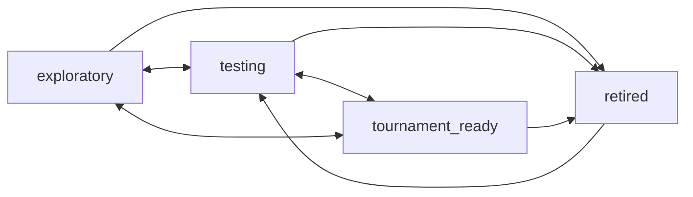

# Feature: Decks

## Summary

A **Deck** is a **link-only** entity — `{ hero/identity, format, external link, metadata }` — with **no
stored card list, no deck builder, and no scraping** of the linked tool's contents
([ADR-0002](../decisions/0002-decks-as-links.md)). Decks are the collaboration anchor for the whole app:
they hang off events, carry a status lifecycle and visibility, and keep a manual **iteration log**.

## Goals & value

- Let members register the decks they're working on without rebuilding tools they already use (Fabrary,
  etc.) — the app is a **collaboration layer over decks-as-links**
  ([ADR-0002](../decisions/0002-decks-as-links.md)).
- Provide structured, aggregable fields (**hero, format, status**) so matchups and meta can be tracked by
  hero/deck even without card lists ([flesh-and-blood](../domain/flesh-and-blood.md)).
- Preserve iteration history in prose since automatic diffs are impossible.

## User stories

- As a **member**, I can create a deck with a hero, format, external link, name, tags, notes, and
  visibility.
- As a **member**, I can keep a deck a **private draft** until it's ready to share with the team.
- As a **member**, I can move a deck through its **status** lifecycle as testing progresses.
- As a **member**, I can add **iteration log** entries describing changes ("-2 X, +2 Y after event").
- As a **team-admin**, I can moderate others' decks (edit / retire / archive).
- As a **member**, I can browse/filter the team's decks by hero, format, status, and tags.
- As a **member**, I can **link a deck to metas** (a multi-select on the deck form). Creating a deck
  **defaults to linking the current meta** (editable); the deck detail lists its linked metas. The join is
  `DeckMeta` (see [metas.md](metas.md)); the API accepts `metaIds` on create/update (omitting it on create
  keeps the current-meta default, an explicit set — even empty — overrides it) and returns `linkedMetas`.
- As a **member**, I can see a deck's **readiness vs the meta** on its detail page: one row per meta deck
  entry with a confidence-weighted win rate + raw sample + a thin-data badge, and whether a matchup
  game-plan exists (Tier-1 archetypes with no plan are flagged). This is a read-only derivation from
  `GameLog` (reusing the kept matchup math — see [confidence-and-matchups.md](confidence-and-matchups.md)),
  served by `GET /api/decks/:deckId/meta-readiness?metaId=` (defaults to the current meta). Game logs match
  an entry when side A is this deck and side B either links the entry directly (`opponentMetaDeckEntryId`)
  or matches the entry's matchup-subject ref (shared hero + label), so repeated heroes under different
  labels aggregate distinctly; a game log's optional `metaId` is not required (a later narrowing).
- As a **member**, I can see a deck's **card observations** on its detail
  page (the **Cards** tab): one row per card with **two separate counts** — how many times it was noted
  *impressive* and how many times *underperforming* — never netted, so a card can show both. It aggregates
  only the deck's **own** side's captured cards (`GameLogCard`, see
  [game-logging.md](game-logging.md)), read-only via `GET /api/decks/:deckId/card-observations`, sorted by
  total observations (desc), then card name. "Relevant" games are the **broadest** attribution (shared
  `deckOwnedGameSides`): the deck was piloted (either side), **or** a side is a meta deck entry the deck is
  linked to, a sibling team deck linked to the same entry, or a bare hero+label ref-matching a linked entry.
  So a game logged against the *meta* build of an archetype the deck represents still feeds the deck's card
  counts. `gamesConsidered` counts the relevant games that contributed at least one of the deck's own cards.
- As a **member**, I can **"Add card idea"** from the deck page: it opens the shared **Task** form
  (see [tasks.md](tasks.md)) pre-linked to this deck with a card-test title/description scaffold ready for
  `+card` mentions — the same `POST /api/tasks` path as the tasks board, not a parallel one. The deck page
  also lists the deck's existing tasks.

## Data

From [data-model](../architecture/data-model.md#decks-link-only--see-adr-0002):

- **Deck** `{ id, teamId, name, gameId, formatId, heroId?, externalUrl, source, ownerId,
  status: 'exploratory' | 'testing' | 'tournament_ready' | 'retired', visibility: 'team' | 'private',
  tags[], notes, archivedAt? }`
- **DeckIterationEntry** `{ id, deckId, authorId, body, createdAt }` — manual changelog; **there is no
  stored card list**.

`heroId`/`formatId` reference per-game identity/format data ([card-database](card-database.md)); `source` is
the recognized link provider (see below). Do not add card-list fields.

## Behavior & rules

### Status lifecycle

- The three **active** states (`exploratory`, `testing`, `tournament_ready`) move **freely in both
  directions**. Any active state may be **retired**. `retired` is a "no longer worked on" terminal that a
  user can **reopen only to `testing`**. A no-op (transition to the current status) is not a valid move.
  The transition table is the single source of truth in `packages/shared` (`deckStatusTransitions`), shared
  by the API validator and the web status control; an invalid move is rejected with 422.
- Status is independent of `archivedAt` (soft-delete). Retiring keeps the deck and its history; archiving
  hides it.

### Visibility

- `private` = a personal draft visible only to the **owner** (and moderating team-admins). `team` = visible
  to all team members. Owners flip visibility when ready.

### Decks as game-log opponents

- There is no separate "reference deck" concept: **any** team deck may be referenced as a game-log opponent
  (side B). A deck is always just a link + metadata, never a stored list.

### Deck-link recognition (best-effort, ToS-safe)

- On create/edit, the app does **best-effort recognition** of the `externalUrl` provider (e.g. Fabrary) via
  the adapter's optional `recognizeDeckUrl` to set a friendly `source` label and, if the URL exposes one, a
  provider `externalId`. It **never fetches or parses the deck's contents** — recognition is
  pattern-matching on the URL only ([game-abstraction](../architecture/game-abstraction.md),
  [ADR-0007](../decisions/0007-external-data-approach.md)).
- Unrecognized URLs are still accepted with a generic `source`.

### Validation & permissions

- `externalUrl` must be a valid URL; `formatId`/`heroId` must belong to the team's game.
- Owners edit/retire/archive their own decks; **team-admins can moderate all** decks in their team
  ([multi-tenancy](../architecture/multi-tenancy.md#roles--capabilities)).

| Action | Owner | Team-admin | Other member |
|---|---|---|---|
| Create own deck | ✅ | ✅ | ✅ |
| Edit / retire / archive | ✅ | ✅ (moderation) | ❌ |
| Add iteration entry | ✅ | ✅ | ❌ (comments instead) |
| View `private` draft | ✅ | ✅ | ❌ |
| View `team` deck | ✅ | ✅ | ✅ |

## API surface

Per [api-conventions](../architecture/api-conventions.md); `teamId` from verified context, never the body:

- `GET /api/decks?heroId=&formatId=&status=&tag=&visibility=&limit=&cursor=` — list (cursor
  pagination); `private` drafts of other users are excluded.
- `POST /api/decks` — create (server stamps `teamId`, `gameId`, `ownerId`; runs URL recognition).
- `GET /api/decks/:deckId` — detail.
- `PATCH /api/decks/:deckId` — update name/status/visibility/tags/notes/externalUrl.
- `DELETE /api/decks/:deckId` — soft-delete (archive).
- `GET /api/decks/:deckId/iteration-entries` / `POST /api/decks/:deckId/iteration-entries` — changelog.

## UI / UX

Mobile-first (see [frontend](../architecture/frontend.md)):

- **Deck list** with hero/format/status/tag filters and a private-vs-team indicator.
- **Create/edit form:** hero picker (autocomplete) and format picker from the active game's reference data,
  external-link field with live provider recognition, tags, notes, visibility toggle, status selector.
- **Deck detail:** metadata, a prominent **"open external list"** link, the **iteration log** timeline, and
  (via [collaboration-core](collaboration-core.md)) comments.
- No card-list UI, no builder — reflect the link-only model clearly.

## Tenancy & permissions

Every deck carries a non-null `teamId`, stamped from the verified context and never the body; all queries
are `teamId`-scoped per [multi-tenancy](../architecture/multi-tenancy.md). `heroId`/`formatId` reference the
team's **game** data. Cross-team foreign keys (e.g. a deck referencing another team's hero/format, or later a
`GameLog` referencing a deck) are rejected; the mechanism is not re-explained here.

## Edge cases

- Duplicate `externalUrl` within a team -> allowed but surfaced as a soft warning (different owners may track
  the same list).
- Editing `externalUrl` to a new provider -> re-run recognition; recognition failure is non-blocking.
- Deck referenced by an event/gauntlet/game log is retired or archived -> keep it (soft-delete) so history
  and aggregates survive; hide from active pickers.
- A `private` deck referenced in a `team`-visible context -> guard so drafts don't leak metadata to
  non-owners.

## Testing notes

Per [testing-strategy](../architecture/testing-strategy.md):

- **Integration:** deck CRUD scoped to team; `teamId`/`gameId`/`ownerId` stamped server-side; status
  transitions; visibility gating (non-owner cannot fetch another user's private draft); iteration entries
  are append-only and authored.
- **Tenant isolation (mandatory):** a user in team A cannot read/write team B's decks even with a forged
  `teamId` (403/404); cross-team `heroId`/`formatId` references rejected.
- **Deck-link recognition:** unit-test provider recognition is **URL-pattern only** and never fetches
  contents; unrecognized URLs still accepted.
- **AuthZ:** non-owner member cannot edit/retire others' decks; team-admin moderation works.
- **Validation:** invalid URL / wrong-game format or hero rejected with the error envelope.

## Out of scope

- **In-app deck building / stored card lists** — cut ([ADR-0002](../decisions/0002-decks-as-links.md)).
- **Scraping or importing deck contents / legality validation / auto version-diffs** — cut
  ([ADR-0002](../decisions/0002-decks-as-links.md), [ADR-0007](../decisions/0007-external-data-approach.md)).
- **Tech packages** (named card groups) — cut
  ([feature-catalog](../product/feature-catalog.md#explicitly-cut-out-of-scope)).
- Game logs, matchups, gauntlets, and game-plans that *reference* decks live in their own specs.

## See also

- [ADR-0002: Decks are links, not card lists](../decisions/0002-decks-as-links.md) ·
  [ADR-0007: External data approach](../decisions/0007-external-data-approach.md)
- [Data model](../architecture/data-model.md) · [Game abstraction](../architecture/game-abstraction.md) ·
  [Multi-tenancy](../architecture/multi-tenancy.md)
- [Card database](card-database.md) · [Events & gauntlets](events-and-gauntlets.md) ·
  [Game logging](game-logging.md) · [Game-plans & deck selection](gameplans-and-deck-selection.md) ·
  [Collaboration core](collaboration-core.md)
- Implementing phase: [phase-03 Decks](../plans/phase-03-decks.md)
