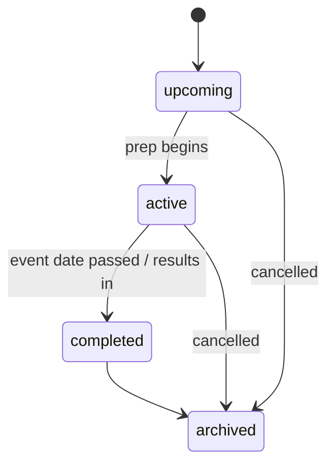

# Feature: Events & Gauntlets

## Summary

The **Event** is TeamBrewer's central organizing concept: a target tournament defined by a format, a date,
and an importance. Testing hangs off it. Each event carries a **gauntlet** — the "field to beat," a set of
reference decks or hero/archetype targets, each with an **expected metagame share** used to prioritize what
to test. Members declare **attendance** (RSVP) so the team knows who is preparing for what. Deck selection
and the post-event retrospective are related but live in
[`gameplans-and-deck-selection.md`](gameplans-and-deck-selection.md).

This is the backbone that later modules (game logging, matchups, coverage, test assignments, game-plans)
optionally reference. See [ADR-0004 event-centric](../decisions/0004-event-centric.md) and
[playtesting-methodology §3 & §6](../domain/playtesting-methodology.md).

## Goals & value

- Give testing a clear shape and deadline: prep targets a specific tournament, not an open-ended library.
- Define the field the team must beat, so effort is deliberate rather than driven by personal preference.
- Weight testing by **expected metagame share** so limited practice reps track how often each archetype is
  likely to be faced ([playtesting-methodology §3](../domain/playtesting-methodology.md)).
- Coordinate the team: who is attending, what the field looks like, what still needs coverage.

## User stories

- As a **team-admin**, I create an event (Calling: Classic Constructed, 2026-09-12, high importance) so the
  team can start prepping.
- As a **member**, I RSVP *going* to an event so the team knows I need a deck and can be assigned tests.
- As a **team-admin**, I build the gauntlet — the expected top archetypes with rough field-share
  percentages — so we know what to beat.
- As a **member**, I browse the gauntlet to see which archetypes matter most before I choose what to test.
- As a **team-admin**, I close an event after it happens so it stops appearing as active prep.

## Data

Uses these entities from [data-model.md](../architecture/data-model.md#events--gauntlets). Every row is
team-scoped with a non-null `teamId`.

- **Event** `{ id, teamId, name, formatId, date, location?, importance, description, status }`
  - `formatId` → a `Format` from the team's game adapter (FaB: CC, Blitz, LL, SAGE…).
  - `importance` — enum ordinal, e.g. `local` | `regional` | `national` | `major` — drives dashboard
    prioritization.
  - `status` — see the transitions below.
- **GauntletEntry** `{ id, eventId, teamId, referenceDeckId (→ Deck where isReference) OR (heroId /
  archetypeLabel), expectedMetaShare (0–100), notes }`
  - Each entry is **either** a link to a reference `Deck` **or** a bare `heroId` / free-text
    `archetypeLabel` (the field can be identified by hero/archetype without a full deck). This is the field
    to beat.
  - `expectedMetaShare` is the entry's projected percentage of the field.
- **Attendance** `{ id, eventId, userId, status: 'going' | 'maybe' | 'not_going' }` — one row per member
  per event (RSVP).

Deck selection (`DeckSelection`) and `Retrospective` are also keyed to the event but are specified in
[`gameplans-and-deck-selection.md`](gameplans-and-deck-selection.md).

## Behavior & rules

### Event status transitions

- `upcoming` — created, not yet in active prep.
- `active` — the team is testing for it; appears on the dashboard as current prep.
- `completed` — the tournament has happened; retrospective can be written; matchups can still be filtered
  by it.
- `archived` — soft-deleted via `archivedAt`; excluded from default lists, history preserved.

### Gauntlet rules

- `expectedMetaShare` is validated to be within `0–100`. The **sum across a gauntlet is not required to
  equal 100** (the field is never fully known and "other" is implicit); the UI surfaces the running total
  as guidance, and shares are normalized only when used as weights for prioritization.
- A `GauntletEntry` must reference exactly one target form: a `referenceDeckId`, **or** a `heroId`, **or**
  an `archetypeLabel`. A `referenceDeckId` must point to a `Deck` where `isReference` is true and belong to
  the same `teamId`.
- Duplicate targets (same hero/archetype/reference deck) within one event's gauntlet are rejected with
  `422`.

### Permissions

- **Create/edit/delete events, gauntlet entries — shared team board (decided in phase-05):** an event and
  its gauntlet are a **collaborative team prep board**, so **any team member may create *and* edit/delete
  any event or gauntlet entry**; team-admins are the same. There is **no per-row owner/creator** on `Event`
  or `GauntletEntry` — authorization is simply "verified member of the active team" (via `TeamContextGuard`),
  on top of tenant isolation. (This resolves an ambiguity between the earlier user stories, which showed only
  admins managing events, and the [multi-tenancy §Roles](../architecture/multi-tenancy.md#roles--capabilities)
  table's "create/edit own"; events have no private visibility, so a shared board is the natural fit.)
- **Attendance:** every member sets **their own** RSVP (`PUT .../attendance/me`, `userId` from the verified
  context). Team-admins can view all attendance; they do not set others' RSVP.

### Collaboration

Events are a **commentable, activity-tracked subject** (`subjectType: "event"`) via the phase-04
[collaboration attach pattern](collaboration-core.md): the event hub renders the shared comment thread and a
per-event activity feed, and event create / update / status-change emit `event_created` / `event_updated` /
`event_status_changed` activity (plus the generic `commented`). An archived event refuses new comments; all
of it is team-scoped (cross-tenant → 404).

## API surface

Indicative REST per [api-conventions.md](../architecture/api-conventions.md). `teamId` is always taken
from the verified team context (`TeamContextGuard`), never from the body.

| Method | Path | Purpose |
|---|---|---|
| `GET` | `/api/events` | List events (filter `?status=&formatId=&importance=`, cursor paginated) |
| `POST` | `/api/events` | Create an event |
| `GET` | `/api/events/:eventId` | Event detail (includes gauntlet + attendance summary) |
| `PATCH` | `/api/events/:eventId` | Update fields / advance status |
| `DELETE` | `/api/events/:eventId` | Archive (soft-delete) |
| `GET` | `/api/events/:eventId/gauntlet-entries` | List gauntlet entries |
| `POST` | `/api/events/:eventId/gauntlet-entries` | Add a gauntlet entry |
| `PATCH` | `/api/events/:eventId/gauntlet-entries/:gauntletEntryId` | Update an entry |
| `DELETE` | `/api/events/:eventId/gauntlet-entries/:gauntletEntryId` | Remove an entry |
| `GET` | `/api/events/:eventId/attendance` | List RSVPs |
| `PUT` | `/api/events/:eventId/attendance/me` | Set my RSVP (idempotent upsert) |

Request/response bodies validate against Zod schemas in `packages/shared`.

## UI / UX

- **Mobile-first.** Event detail is the prep hub: header (name, format, date, importance, status), gauntlet
  list, attendance, and links out to matchups/coverage and deck selection.
- **Gauntlet builder:** add an entry by picking a reference deck, or a **hero via autocomplete**, or typing
  an archetype label; set `expectedMetaShare` with a slider/number field. Show the running total of shares
  and a subtle warning if it wildly exceeds 100. Hero pickers use card/hero autocomplete backed by the game
  adapter's reference data.
- **Expected-metagame visualization:** a simple share bar so the team sees the field at a glance, sorted by
  `expectedMetaShare` descending.
- **Attendance:** a prominent going / maybe / not_going toggle for the current user plus a compact roster
  of who is attending.

## Tenancy & permissions

All event, gauntlet, and attendance rows carry `teamId` and are filtered server-side by the verified active
team. A reference deck used in a gauntlet must belong to the same team (cross-team foreign keys are
rejected). See [multi-tenancy.md](../architecture/multi-tenancy.md). Cross-tenant reads return `404`, never
leaking existence.

## Edge cases

- **Format changes after gauntlet exists:** allowed, but warn — gauntlet entries and any linked games were
  built for the old format; nothing is auto-deleted.
- **Gauntlet entry references a deck that gets archived:** keep the entry (soft-delete preserves history);
  render the archived deck with an "archived" marker.
- **Expected shares summing above 100:** permitted, warned, normalized when used as weights.
- **Member RSVPs then leaves the team:** their `Attendance` row is retained for history but the user no
  longer appears in the active roster.
- **Event date in the past on creation:** allowed (back-filling a completed event for its retrospective and
  logged games).

## Testing notes

Follow [testing-strategy.md](../architecture/testing-strategy.md).

- **Tenant isolation:** a user in team A cannot read or write team B's events, gauntlet entries, or
  attendance even with a forged `teamId` (expect `404`/`403`). A gauntlet entry cannot reference a
  reference deck from another team.
- **Validation:** `expectedMetaShare` outside `0–100` rejected; a gauntlet entry with zero or more than one
  target form rejected; duplicate gauntlet targets rejected.
- **Status transitions:** only legal transitions accepted; illegal ones return `422`.
- **Attendance idempotency:** repeated `PUT .../attendance/me` upserts a single row per user.
- **Filtering:** listing by `status`/`formatId`/`importance` returns the expected subset.

## Out of scope

- **Deck selection & lock-in**, and the **retrospective** — see
  [`gameplans-and-deck-selection.md`](gameplans-and-deck-selection.md).
- **Test assignments** driven by the gauntlet — see [`testing-queue.md`](testing-queue.md).
- **Matchup aggregation and coverage math** — see [`confidence-and-matchups.md`](confidence-and-matchups.md).
- External event calendars / imports; automatic metagame data feeds (`expectedMetaShare` is entered by the
  team).

## See also

- [ADR-0004 event-centric](../decisions/0004-event-centric.md)
- [playtesting-methodology.md](../domain/playtesting-methodology.md) (§3, §6)
- [data-model.md](../architecture/data-model.md) · [multi-tenancy.md](../architecture/multi-tenancy.md) ·
  [api-conventions.md](../architecture/api-conventions.md)
- [`game-logging.md`](game-logging.md) · [`confidence-and-matchups.md`](confidence-and-matchups.md) ·
  [`testing-queue.md`](testing-queue.md) · [`gameplans-and-deck-selection.md`](gameplans-and-deck-selection.md) ·
  [`dashboard.md`](dashboard.md) · [`decks.md`](decks.md)
- Implementing phase: [`phase-05-events-and-gauntlets.md`](../plans/phase-05-events-and-gauntlets.md)
</content>
</invoke>
