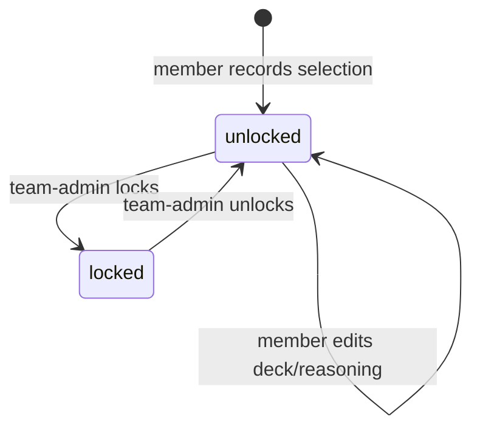

# Feature: Game-Plans & Deck Selection

## Summary

The endgame of event-centric prep. This module turns testing into decisions: written **matchup
game-plans** (FaB's equivalent of "sideboard guides"), a per-member **deck selection** for an event
(which the team-admin can lock), and a post-event **retrospective** that feeds learnings back into the
team library. It closes the loop opened by [ADR-0004](../decisions/0004-event-centric.md): every event
ends in a confident deck choice and a durable review.

## Goals & value

- Capture the **written plan** for a matchup so knowledge survives
  past a single conversation (playtesting-methodology §4: tech + plans win close matchups).
- Let each member **commit** to what they will bring to an event, with reasoning, and let the team-admin
  **lock** the roster once the choice is made.
- Make every event end in a **retrospective** so the next event starts smarter
  ([playtesting-methodology.md §6](../domain/playtesting-methodology.md)).

## User stories

- As a member, I read the current game-plan for my deck against a top archetype before I sit down to play.
- As a theorist, I write and revise the game-plan for a hard matchup, referencing the key cards and lines.
- As a member, I record my deck selection for the upcoming event and explain why I chose it.
- As a team-admin, I lock deck selections once the team has decided, so nobody quietly changes course.
- As the team, we write a retrospective after the event capturing results and learnings.

## Data

Exact entities from [data-model.md](../architecture/data-model.md) (all team-scoped, non-null `teamId`).

### `MatchupGamePlan`
`{ id, teamId, ourDeckId (→ Deck), formatId, name, body, updatedBy }`

- A written, living guide for a matchup. FaB has **no MTG-style sideboards**; a game-plan captures
  the equipment/weapon/card choices, mulligan priorities, sequencing, and lines (see
  [flesh-and-blood.md](../domain/flesh-and-blood.md)).
- A plan is titled by a **free-text `name`** (editable on create and edit). Names are free-form: a deck
  may have several plans and **duplicate names are allowed** (no uniqueness constraint).
- A game-plan **covers specific meta deck entries** via the `GamePlanMetaDeckEntry` join (the "Covers
  matchups" selection); create/update accept `metaDeckEntryIds`. This coverage is what feeds a deck's
  readiness "planned" state.
- **Key cards (meta-pivot redesign, WS-4):** referenced **inline in `body`** as `+[[cardId]]` tokens (the
  shared `+card` mention model — see `packages/shared/src/card-tokens.ts`), not a structured chip list. They
  resolve against the global card database (link-only decks mean we reference cards, never a stored list —
  [ADR-0002](../decisions/0002-decks-as-links.md)) and render as inline chips with hover/press preview. The
  old structured `MatchupGamePlanCard` child table was dropped.

### `DeckSelection`
`{ id, eventId (→ Event), userId, deckId (→ Deck), locked, lockedAt?, reasoning }`

- One record per `(event, user)`: what that member commits to bring, plus free-text `reasoning`.

### `Retrospective`
`{ id, eventId (→ Event), teamId, authorId, body, resultsSummary, learnings }`

- The post-event review. `resultsSummary` records how the team did; `learnings` seeds future prep and can
  be linked from primers and the decisions log ([team-knowledge.md](team-knowledge.md)).

## Behavior & rules

### Game-plans
- A plan has a free-text `name` (no uniqueness — a deck may have several, duplicates allowed); editing
  updates `name`/`body`/covered decks in place and stamps `updatedBy`. Any member may create or edit;
  team-admins may edit or archive any.
- `body` is markdown; card references validated against the active team's game (`gameId`).
- Game-plans are collaboration subjects: comments/@mentions attach via `subjectType: 'matchup_game_plan'`
  ([collaboration-core.md](collaboration-core.md)).

### Deck selection
- A member may create/update **their own** selection while it is unlocked. `deckId` must be a deck in the
  same team.
- **Locking:** only a team-admin can set `locked = true` (stamping `lockedAt`). Once locked, the member
  cannot change `deckId` or `reasoning`; a team-admin may unlock to allow changes.



### Retrospective
- Typically one per event (the shared team review); any member may author, team-admins may edit/archive.
- Validation: `body` required; `resultsSummary` and `learnings` optional but encouraged.

## API surface

REST per [api-conventions.md](../architecture/api-conventions.md); `teamId` from the verified
`TeamContextGuard` context, never the body.

```
# Game-plans
GET    /api/game-plans?ourDeckId=&formatId=
POST   /api/game-plans
GET    /api/game-plans/:gamePlanId
PATCH  /api/game-plans/:gamePlanId
DELETE /api/game-plans/:gamePlanId          # soft-delete

# Deck selection (nested under the event)
GET    /api/events/:eventId/deck-selections           # team-admin: all; member: at least own
PUT    /api/events/:eventId/deck-selections/me        # upsert caller's own selection
PATCH  /api/events/:eventId/deck-selections/:selectionId/lock    # team-admin only
PATCH  /api/events/:eventId/deck-selections/:selectionId/unlock  # team-admin only

# Retrospective (nested under the event)
GET    /api/events/:eventId/retrospective
POST   /api/events/:eventId/retrospective
PATCH  /api/events/:eventId/retrospective/:retrospectiveId
```

## UI / UX (mobile-first)

- **Game-plan view:** the plan's name header, the body rendered with inline
  `+[[cardId]]` card chips (hover/press card previews), and an inline comment thread. Reachable from the
  deck page.
- **Deck selection:** on the event page, a compact "My pick" card (deck autocomplete + reasoning) plus a
  team roster list showing everyone's selection and lock state; a lock badge when locked.
- **Retrospective:** long-form markdown editor with `resultsSummary` / `learnings` sections; read view
  linked prominently from a past event.

## Tenancy & permissions

Follows [multi-tenancy.md](../architecture/multi-tenancy.md): every row carries `teamId`; all queries are
scoped to the verified active team. `ourDeckId`, `deckId`, and any `GauntletEntry`/`Event`
foreign keys must belong to the **same team** — cross-team references are rejected. Locking/unlocking is
team-admin only; members edit only their own selection.

## Edge cases

- **Deck retired/archived after selection or in a game-plan:** keep the reference (soft-delete preserves
  history); flag it visually as retired.
- **Plan later tied to a formalized meta deck entry:** attach the plan to the matching `MetaDeckEntry` via
  `metaDeckEntryIds` (the `GamePlanMetaDeckEntry` join) without losing the body.
- **Member changes deck after lock:** blocked with 422; message explains a team-admin must unlock.
- **Several plans per deck:** allowed — names are free-form with no uniqueness, so a deck can hold
  multiple plans (there is no duplicate-matchup 409).
- **Event with no format-matching decks:** deck-selection picker warns if the chosen deck's `formatId`
  differs from the event's format (warning, not a hard block — humans own the list).

## Testing notes

Per [testing-strategy.md](../architecture/testing-strategy.md):

- **Tenant isolation (mandatory):** a user in team A cannot read/write team B's game-plans, deck
  selections, or retrospectives (cross-tenant → 404); a game-plan cannot reference a deck/card/event from
  another team.
- **Permissions:** members can edit only their own `DeckSelection`; lock/unlock rejected for non-admins
  (403); locked selection edits rejected (422).
- **Validation:** markdown/body required; card references resolve within the team's game.
- **Behavior:** lock → unlock → edit transitions; game-plans are free-form (name + covered decks + body),
  no per-matchup uniqueness.

## Out of scope

- Auto-generating game-plans or roster recommendations (the "what to test next" recommendation lives in
  [dashboard.md](dashboard.md)); this module is authored content.
- Any stored deck card-list or in-app deck building ([ADR-0002](../decisions/0002-decks-as-links.md)).
- Email notification of locks/selections — notifications are in-app only ([collaboration-core.md](collaboration-core.md)).
- Legality validation of the chosen deck.

## See also

- [decks.md](decks.md) · [events-and-gauntlets.md](events-and-gauntlets.md) ·
  [confidence-and-matchups.md](confidence-and-matchups.md) · [testing-queue.md](testing-queue.md) ·
  [collaboration-core.md](collaboration-core.md) · [card-database.md](card-database.md)
- [ADR-0004 event-centric](../decisions/0004-event-centric.md) ·
  [ADR-0002 decks-as-links](../decisions/0002-decks-as-links.md)
- [data-model.md](../architecture/data-model.md) · [multi-tenancy.md](../architecture/multi-tenancy.md) ·
  [api-conventions.md](../architecture/api-conventions.md) · [frontend.md](../architecture/frontend.md)
- [playtesting-methodology.md](../domain/playtesting-methodology.md) ·
  [flesh-and-blood.md](../domain/flesh-and-blood.md)
- Implementing phase: [phase-09-gameplans-and-deck-selection](../plans/phase-09-gameplans-and-deck-selection.md)
