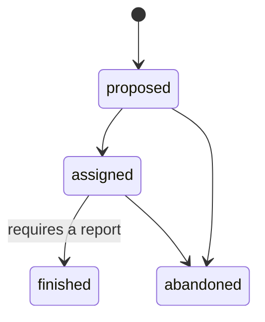

# Feature: Tasks

## Summary

A **Task** is one free-form unit of testing work. It **merges the old two testing-queue models**
(`CardTestSuggestion` + `TestAssignment`) into a single model
([ADR-0010](../decisions/0010-meta-as-organizing-hub.md)): a title + prose description, an optional deck
link, member **upvotes**, an **assignee**, and a guarded status lifecycle whose `finished` state demands a
**report**. Cards are referenced **inline** in the description as `+[[cardId]]` tokens (the `+card`
composer) — there is no card foreign-key table. Tasks replace both the per-deck "suggestion board" and the
standalone "assignments" page.

## Goals & value

- One place for "things to test", whether a loose idea, a tech-card swap, or "someone please pilot the
  bogeyman" — no artificial split between suggestions and assignments.
- Keep the team's testing intent visible and votable, and record a durable **conclusion** when work
  finishes.
- Link cards where they are discussed (inline in prose), consistent with `@member` mentions.

## User stories

- As a **member**, I create a task ("Test `+[[card]]` in Fai" linked to my Fai deck) so the idea isn't lost.
- As a **member**, I upvote a task so the team can see what's worth prioritizing.
- As a **member**, I self-assign (or assign a teammate) a task and move it to `assigned`.
- As the **assignee**, I finish a task and record a report of what I found; the report is visible to the
  team.

## Data

Uses these entities from [data-model.md](../architecture/data-model.md). `Task` is team-scoped with a
non-null `teamId`; `TaskVote` is scoped through its parent task.

- **Task** `{ id, teamId, authorId, title, description, deckId?, status, assigneeId?, report, archivedAt? }`
  - `description` may embed inline `+[[cardId]]` tokens (see [`+card` composer](#card-linking)); linked
    cards are **not** stored as rows — they are parsed from the body.
  - `deckId?` optionally links the task to a deck; `assigneeId?` is the current owner of the work.
  - `report` records the durable conclusion, required when finishing.
- **TaskVote** `{ id, taskId, userId }` — one upvote per member per task (`@@unique(taskId, userId)`); the
  row's existence **is** the upvote (no `value`). No `teamId` (reached through the parent task).

### Task status lifecycle

- `proposed → [assigned, abandoned]`, `assigned → [finished, abandoned]`; `finished` and `abandoned` are
  terminal. Illegal transitions (and no-ops) are rejected. Moving to **`finished` requires a non-empty
  `report`** (mirrors the old resolution-note-on-resolve rule). The transition map + report rule are
  single-sourced in `packages/shared` (`tasks.ts`) and shared by the API validator and the web control.

### Card linking

Card references are stored inline in any prose body as a stable token `+[[cardId]]` (card names contain
spaces, so free-text matching is unsafe — the token carries the id). A shared pure parser/tokenizer
(`card-tokens.ts`: `formatCardToken`, `parseCardTokens`, `tokenizeCardBody`) resolves tokens to card chips
at render time; the `+`-trigger composer mirrors the `@member` mention composer. `@member` mentions are
unchanged. Applied to task `description`, matchup game-plan `body`, and deck `notes` / iteration entries.

## Behavior & rules

- **Ownership:** any member creates a task and self-assigns; the creator, the assignee, and team-admins may
  edit; team-admins moderate. (Ported from the test-assignment ownership rules.)
- A task is a **commentable, activity-tracked subject** (`subjectType: "task"`) via the collaboration attach
  pattern, emitting `task_created` / `task_updated` / `task_status_changed` (+ generic `commented`).
- `DELETE` archives (`archivedAt`); archived tasks are excluded from default lists.
- Cross-team/cross-game foreign keys (deck, assignee) are rejected; cross-tenant reads return `404`.

## API surface

Indicative REST; `teamId`/`authorId` come from the verified context. (Endpoints land in WS-3 — `TasksModule`.)

| Method | Path | Purpose |
|---|---|---|
| `GET` | `/api/tasks` | List tasks (filters `?deckId=&assigneeId=&status=`, cursor paginated) |
| `POST` | `/api/tasks` | Create a task |
| `GET` | `/api/tasks/:taskId` | Task detail |
| `PATCH` | `/api/tasks/:taskId` | Update fields / assign / advance status (report required to finish) |
| `DELETE` | `/api/tasks/:taskId` | Archive (soft-delete) |
| `PUT` | `/api/tasks/:taskId/votes/me` | Add my upvote (idempotent) |
| `DELETE` | `/api/tasks/:taskId/votes/me` | Remove my upvote |

Request/response bodies validate against the Zod schemas in `packages/shared` (`tasks.ts`).

## Tenancy & permissions

`task` is in `TEAM_OWNED_MODELS`; `TaskVote` is scoped through its parent. See
[multi-tenancy.md](../architecture/multi-tenancy.md).

## Testing notes

- **Tenant isolation:** a user in team A cannot read/write team B's tasks or votes even with a forged
  `teamId`; a task cannot link another team's deck.
- **Status lifecycle:** only legal transitions accepted (illegal / no-op → `422`); finishing without a
  report rejected.
- **Voting idempotency:** repeated `PUT .../votes/me` yields a single row per user.

## See also

- [ADR-0010 meta as the organizing hub](../decisions/0010-meta-as-organizing-hub.md)
- [testing-queue.md](testing-queue.md) (the two superseded models) ·
  [collaboration-core.md](collaboration-core.md) · [decks.md](decks.md) · [metas.md](metas.md)
- [data-model.md](../architecture/data-model.md) · [multi-tenancy.md](../architecture/multi-tenancy.md)
