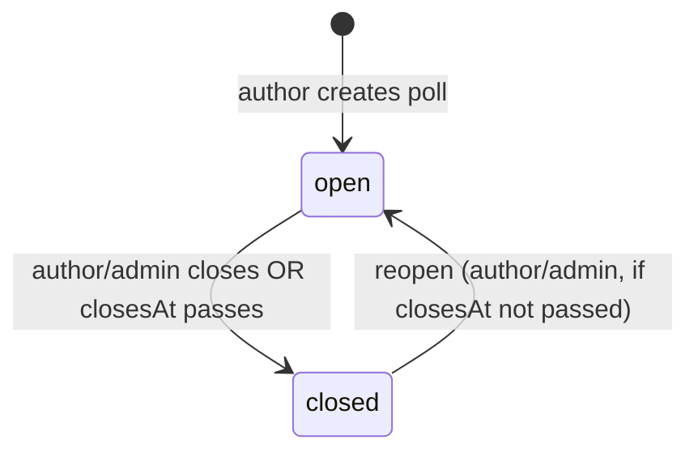

# Feature: Team Knowledge

## Summary

The team's durable memory: long-form **primers** (living deck/matchup/format documents), a **decisions
log** (what the team settled on and *why*), and **polls** for group choices (e.g. "which deck for
Nationals?"). Where [collaboration-core.md](collaboration-core.md) keeps discussion attached to things,
this module keeps the **conclusions** so debates don't repeat and knowledge survives past chat
([playtesting-methodology.md §5](../domain/playtesting-methodology.md)).

## Goals & value

- Turn accumulated testing into readable, reusable guides (primers) instead of tribal knowledge.
- Record decisions with their **context, decision, and rationale** so the team remembers *why*, not just
  *what*.
- Make group choices explicit and fair with lightweight polls, closing the loop on prep.

## User stories

- As a theorist, I write a deck primer that new members read to get up to speed on a deck.
- As a member, I read the matchup primer for a hard pairing before an event.
- As a team-admin, I record the decision to bring deck X to the event, with the rationale, linked to the
  retrospective it came from.
- As a member, I vote in a poll on which deck the team should register, and see the tally.

## Data

Exact entities from [data-model.md](../architecture/data-model.md) (all team-scoped, non-null `teamId`).

### `Primer`
`{ id, teamId, authorId, title, kind: 'deck_primer' | 'matchup' | 'format_notes' | 'other',
relatedDeckId? (→ Deck), body (markdown), visibility, archivedAt? }`

- A long-form **living document**. `kind` classifies it; `relatedDeckId` links a `deck_primer`/`matchup`
  primer to its deck. `body` is authored as plain text and rendered as pre-wrapped text on read (no
  markdown library — a decision recorded in [phase-10](../plans/phase-10-team-knowledge.md); card
  hover-preview inside bodies is deferred).
- `visibility` mirrors deck visibility semantics (`team` | `private`) so an author can draft privately.

### `Decision`
`{ id, teamId, authorId, title, context, decision, rationale, relatedSubjectRef?, decidedAt }`

- A structured record: **context** (the situation/question), **decision** (what was chosen), **rationale**
  (why). `relatedSubjectRef` optionally points at the subject it concerns (e.g. an event, deck, or
  retrospective), using the same polymorphic addressing as collaboration.

### `Poll` + `PollVote`
- **`Poll`** `{ id, teamId, authorId, question, options[], closesAt?, status }`
- **`PollVote`** `{ id, pollId, userId, optionId }` — one vote per user per poll.

## Behavior & rules

### Primers
- Any member may create/edit primers; team-admins may moderate/archive any. A `private` primer is visible
  only to its author (and team-admins for moderation); `team` primers are visible to all team members.
- `title` and `kind` required; `relatedDeckId` (when set) must be a same-team deck. Any member may edit a
  primer they can see; the author or a team-admin may archive.
- Primers are collaboration subjects (`subjectType: 'primer'`) — comments/@mentions attach.

### Decisions
- `title`, `context`, `decision`, `rationale` required; `decidedAt` defaults to now. The log is
  append-oriented — decisions are the record; superseding a decision is a **new** decision that references
  the old one (via `relatedSubjectRef`) rather than an in-place rewrite.
- Any member may record a decision; team-admins may edit/correct.

### Polls
- `question` and at least two `options` required. A poll moves `open → closed` when the author/team-admin
  closes it or `closesAt` passes.



- Voting is allowed only while `open`; one `PollVote` per `(pollId, userId)` — re-voting updates the
  existing vote. Results (tally per option) are visible to team members.

## API surface

REST per [api-conventions.md](../architecture/api-conventions.md); `teamId` from the verified context.

```
# Primers
GET    /api/primers?kind=&relatedDeckId=&cursor=
POST   /api/primers
GET    /api/primers/:primerId
PATCH  /api/primers/:primerId
DELETE /api/primers/:primerId                 # soft-delete

# Decisions log
GET    /api/decisions?cursor=
POST   /api/decisions
GET    /api/decisions/:decisionId
PATCH  /api/decisions/:decisionId

# Polls
GET    /api/polls?status=&cursor=
POST   /api/polls
GET    /api/polls/:pollId                     # includes tally
PATCH  /api/polls/:pollId                     # edit/close/reopen (author or team-admin)
PUT    /api/polls/:pollId/vote                # upsert caller's vote: { optionId }
DELETE /api/polls/:pollId/vote                # retract caller's vote
```

Foreign keys (`relatedDeckId`, `relatedSubjectRef`) validated to be same-team; `teamId` never from body.

## UI / UX (mobile-first)

- **Primers:** a searchable/filterable list (by `kind`, related deck); a read view (pre-wrapped plain text)
  with an inline comment thread; a plain-text editor for authoring (no markdown library — see the
  [phase-10](../plans/phase-10-team-knowledge.md) decision).
- **Decisions log:** a reverse-chronological list of concise cards (title + decision), each expanding to
  context/rationale and a link to the related subject; prominent from the event page and retrospective.
- **Polls:** a compact card with options as large tap targets, live tally after voting, a countdown to
  `closesAt`, and a closed state showing the final result.

## Tenancy & permissions

Follows [multi-tenancy.md](../architecture/multi-tenancy.md): every primer, decision, poll, and vote
carries `teamId` and is scoped to the verified active team. `PollVote` is additionally per `userId`.
`private` primers are visible only to the author (plus team-admin moderation). Cross-tenant reads return
404; cross-team foreign keys rejected.

## Edge cases

- **Voting on a closed poll:** rejected (422).
- **Editing poll options after votes exist:** disallow removing/renaming options with votes (or require
  explicit reset) to keep the tally meaningful.
- **`relatedDeckId` deck retired/archived:** keep the link (soft-delete preserves history), flag as retired.
- **Superseded decision:** old decision remains; the new one links back — the log never loses history.
- **Private primer author leaves the team:** membership removal governs access; content is retained under
  the team per soft-delete rules.
- **`closesAt` in the past on creation:** rejected (422).

## Testing notes

Per [testing-strategy.md](../architecture/testing-strategy.md):

- **Tenant isolation (mandatory):** a user in team A cannot read/write team B's primers, decisions, polls,
  or votes (cross-tenant → 404/empty); foreign keys cannot cross teams.
- **Visibility:** `private` primers hidden from other members; visible to author and team-admin moderation.
- **Poll rules:** one vote per user (upsert), no voting when closed, tally correctness with a crafted
  dataset, open↔closed transitions incl. `closesAt` expiry.
- **Validation:** required fields on primers/decisions/polls; ≥2 distinct options; a `relatedDeckId` /
  `relatedSubjectRef` must resolve within the team.

## Out of scope

- Wiki-style page hierarchies, cross-linking graphs, or version history/diffing of primers (plain-text +
  soft-delete only for now).
- A markdown editor / sanitized renderer, and card hover-preview inside bodies (deferred by decision).
- Rich real-time co-editing.
- Email notification of new primers/decisions/polls — awareness is via in-app
  [collaboration-core.md](collaboration-core.md) (mentions, activity feed).
- Ranked-choice or weighted polls (single-choice tally only).

## See also

- [collaboration-core.md](collaboration-core.md) · [decks.md](decks.md) ·
  [gameplans-and-deck-selection.md](gameplans-and-deck-selection.md) ·
  [events-and-gauntlets.md](events-and-gauntlets.md) · [card-database.md](card-database.md) ·
  [dashboard.md](dashboard.md)
- [data-model.md](../architecture/data-model.md) · [multi-tenancy.md](../architecture/multi-tenancy.md) ·
  [api-conventions.md](../architecture/api-conventions.md) · [frontend.md](../architecture/frontend.md)
- [playtesting-methodology.md §5](../domain/playtesting-methodology.md)
- Implementing phase: [phase-10-team-knowledge](../plans/phase-10-team-knowledge.md)
