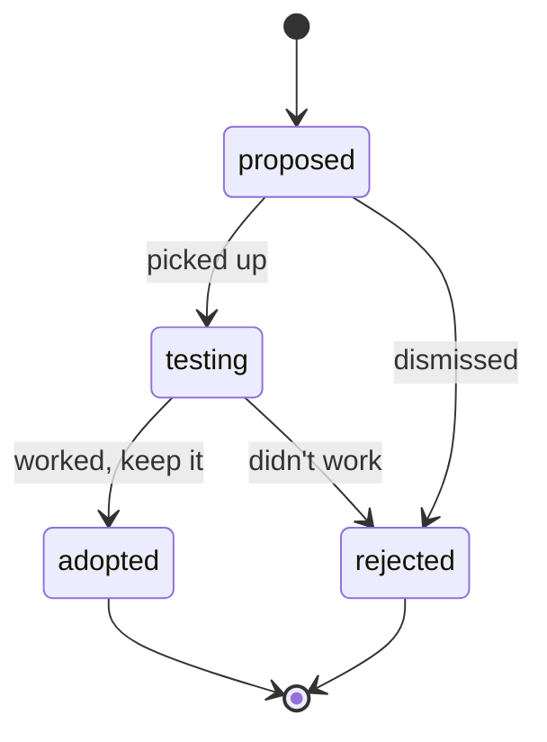
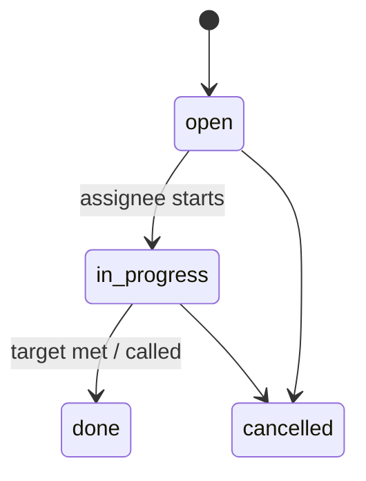

# Feature: Testing Queue

## Summary

The testing queue turns loose ideas and gaps into tracked work. It has two complementary parts:

1. **Card-test suggestions** — per-deck proposals to try card X (optionally over card Y) with reasoning,
   moving through a lifecycle (`proposed → testing → adopted / rejected`) and gathering **votes**. This
   captures tech-card ideas that win close matchups
   ([playtesting-methodology §4](../domain/playtesting-methodology.md)).
2. **Test assignments** — tracked tasks handing a specific matchup (our deck × an opponent target) to a
   specific member, directly targeting the "**nobody pilots the bogeyman**" failure mode
   ([playtesting-methodology §2](../domain/playtesting-methodology.md)).

Discussion on both happens through the shared collaboration layer
([`collaboration-core.md`](collaboration-core.md)); coverage gaps that motivate assignments come from
[`confidence-and-matchups.md`](confidence-and-matchups.md).

## Goals & value

- Ensure the field's best/most-hated decks actually get tested from both sides via explicit **assignments**
  ([playtesting-methodology §2](../domain/playtesting-methodology.md)).
- Capture **tech-card ideas** with reasoning and a clear status so they don't get lost in chat
  ([playtesting-methodology §4–5](../domain/playtesting-methodology.md)).
- Let the team **vote** to surface promising suggestions.
- Close the loop with coverage: thin matchups become assignments; adopted suggestions inform deck iteration.

## User stories

- As a **member**, I suggest "+2 *Command and Conquer* / −2 *Sink Below*" for our Kassai deck with reasoning
  so the team can evaluate it.
- As a **member**, I upvote a suggestion I think is worth testing.
- As a **team-admin**, I move a promising suggestion to `testing`, then mark it `adopted` or `rejected` with
  a resolution note once we have data.
- As a **team-admin**, I assign a teammate to test our deck against the bogeyman gauntlet archetype, with a
  target number of games, because the coverage tracker shows that matchup is thin.
- As an **assignee**, I see my open assignments and mark one done as I log games against that matchup.

## Data

Uses these entities from [data-model.md](../architecture/data-model.md#testing-queue). All team-scoped
(`teamId`).

- **CardTestSuggestion** `{ id, teamId, deckId, authorId, cardInId (→ Card), cardOutId? (→ Card),
  reasoning, status: 'proposed' | 'testing' | 'adopted' | 'rejected', resolutionNote }`
  - Per-deck; `cardInId` required, `cardOutId` optional (a straight add vs a swap). Cards come from the
    card DB (autocomplete / hover), not from a stored deck list ([ADR-0002](../decisions/0002-decks-as-links.md)).
- **SuggestionVote** `{ id, suggestionId, userId }` — one **upvote** per user per suggestion. Decided with
  the user in phase-08: voting is **upvote-only** (a single tap; the row's existence is the upvote, so
  there is no stored `value`), matching the "single tap" + "sort by votes" UI.
- **TestAssignment** `{ id, teamId, eventId?, assigneeId, assignedById, deckId (ours),
  opponentRef (gauntletEntryId | heroId | archetypeLabel), opponentSnapshotLabel, targetGames?, status, notes }`
  - Ties our deck to an opponent target; `opponentRef` can point at a gauntlet entry, a hero, or an
    archetype label. Optional `eventId` scopes it to an event's prep; optional `targetGames` sets a goal.
  - **`opponentSnapshotLabel`** (phase-08, with the user) is a server-derived human label resolved at write
    time (the gauntlet entry's target, the hero name, or the archetype label) so a later-deleted gauntlet
    entry/hero keeps the assignment meaningful — see the edge case below.

## Behavior & rules

### Card-test suggestion lifecycle

- Moving to `adopted` or `rejected` **requires a `resolutionNote`** (why), so conclusions are durable
  ([playtesting-methodology §5](../domain/playtesting-methodology.md)).
- `adopted` does not mutate any deck (decks are links); it is a recorded conclusion and a prompt to update
  the deck's manual iteration log in the linked tool.

### Test assignment status

- `targetGames` is a soft goal; the UI shows progress against games logged for that (deck × opponent)
  matchup (from [`game-logging.md`](game-logging.md) / [`confidence-and-matchups.md`](confidence-and-matchups.md)).

### Permissions

- **Suggestions:** any member may create a suggestion and vote. The author or a team-admin may edit; status
  transitions to `adopted`/`rejected` are typically team-admin (or author) actions per
  [multi-tenancy §Roles](../architecture/multi-tenancy.md#roles--capabilities).
- **Votes:** one upvote per user per suggestion; a repeated `PUT` is idempotent and `DELETE` retracts.
- **Assignments:** team-admins create and assign; assignees update their own assignment status. Members may
  self-assign where the team allows.

### Validation

- `CardTestSuggestion` requires a valid `cardInId`; `cardOutId`, if present, must differ from `cardInId`.
  Both cards must belong to the team's game.
- `TestAssignment.opponentRef` must be exactly one of {gauntlet entry, hero, archetype label}; a
  `gauntletEntryId` must belong to the same team (and its event).
- Only legal status transitions accepted; others return `422`.

## API surface

Indicative REST per [api-conventions.md](../architecture/api-conventions.md); `teamId` from verified
context.

| Method | Path | Purpose |
|---|---|---|
| `GET` | `/api/card-test-suggestions` | List (filter `?deckId=&status=`, cursor paginated) |
| `POST` | `/api/card-test-suggestions` | Create a suggestion |
| `PATCH` | `/api/card-test-suggestions/:suggestionId` | Edit / transition status (resolution note required for adopted/rejected) |
| `DELETE` | `/api/card-test-suggestions/:suggestionId` | Archive (soft-delete) |
| `PUT` | `/api/card-test-suggestions/:suggestionId/votes/me` | Cast my upvote (idempotent upsert) |
| `DELETE` | `/api/card-test-suggestions/:suggestionId/votes/me` | Retract my vote |
| `GET` | `/api/test-assignments` | List (filter `?eventId=&assigneeId=&status=&deckId=`) |
| `POST` | `/api/test-assignments` | Create/assign a test |
| `PATCH` | `/api/test-assignments/:assignmentId` | Update status / target / notes |
| `DELETE` | `/api/test-assignments/:assignmentId` | Archive (soft-delete) |

Bodies validate against Zod schemas in `packages/shared`.

## UI / UX

- **Mobile-first.** Suggestions live on the deck page: a compact list showing in/out cards (with **card
  hover/press preview**), reasoning snippet, vote count, and status badge. Creating one uses **card
  autocomplete** (name + pitch for FaB) for in/out.
- **Voting** is a single tap; the list can sort by votes to surface the strongest ideas.
- **My assignments** view: the assignee's open tasks (our deck vs opponent, target games, progress), with a
  quick jump to the fast **game-logging** form pre-filled with that matchup.
- **Coverage integration:** from the coverage tracker
  ([`confidence-and-matchups.md`](confidence-and-matchups.md)), a one-tap "assign this matchup" creates a
  `TestAssignment` for the thin pairing.
- **Discussion:** comment threads and @mentions on suggestions and assignments via
  [`collaboration-core.md`](collaboration-core.md).

## Tenancy & permissions

All suggestions, votes, and assignments carry `teamId` and are filtered server-side by the verified active
team. Referenced `deckId`, `eventId`, `gauntletEntryId`, and cards must belong to the same team/game;
cross-team foreign keys are rejected. Cross-tenant reads return `404`. See
[multi-tenancy.md](../architecture/multi-tenancy.md).

## Edge cases

- **Suggestion for an archived deck:** existing suggestions are retained (history); creating new ones on an
  archived deck is blocked.
- **Voting on your own suggestion:** allowed (it is a signal, not a conflict of interest control).
- **Adopted suggestion later reversed:** create a new suggestion (or re-open) rather than silently editing a
  resolved one; the resolution note preserves the trail.
- **Assignment target met without a `targetGames` set:** assignee marks `done` manually.
- **Assignee leaves the team:** the assignment is retained; it surfaces as unassigned/needs-reassignment.
- **opponentRef points at a gauntlet entry that is later removed:** the assignment keeps a snapshot of the
  target (hero/archetype label) so it remains meaningful.

## Testing notes

Follow [testing-strategy.md](../architecture/testing-strategy.md).

- **Status transitions:** legal transitions accepted, illegal ones `422`; `adopted`/`rejected` without a
  `resolutionNote` rejected.
- **Votes:** one row per user per suggestion; repeated `PUT` upserts; retract removes; vote counts correct.
- **Validation:** `cardOutId` equal to `cardInId` rejected; `opponentRef` with zero or multiple targets
  rejected; cards/decks from another game or team rejected.
- **Tenant isolation:** a user in team A cannot read/write team B's suggestions, votes, or assignments even
  with a forged `teamId`; cross-team `deckId`/`gauntletEntryId` references rejected.
- **Coverage linkage:** creating an assignment from a coverage gap targets the correct (deck × opponent)
  pairing.

## Out of scope

- **Matchup aggregation and the coverage math** that motivates assignments — see
  [`confidence-and-matchups.md`](confidence-and-matchups.md).
- **Logging** the games that fulfill an assignment — see [`game-logging.md`](game-logging.md).
- **Written matchup game-plans** (the plan, not the tech idea) — see
  [`gameplans-and-deck-selection.md`](gameplans-and-deck-selection.md).
- **Comment/mention/notification mechanics** — owned by [`collaboration-core.md`](collaboration-core.md).
- Any deck card-list validation — decks are links ([ADR-0002](../decisions/0002-decks-as-links.md)).

## See also

- [playtesting-methodology.md](../domain/playtesting-methodology.md) (§2, §4, §5) ·
  [ADR-0002 decks-as-links](../decisions/0002-decks-as-links.md)
- [data-model.md](../architecture/data-model.md) · [multi-tenancy.md](../architecture/multi-tenancy.md) ·
  [api-conventions.md](../architecture/api-conventions.md) · [frontend.md](../architecture/frontend.md)
- [`confidence-and-matchups.md`](confidence-and-matchups.md) ·
  [`events-and-gauntlets.md`](events-and-gauntlets.md) · [`game-logging.md`](game-logging.md) ·
  [`collaboration-core.md`](collaboration-core.md) · [`decks.md`](decks.md) ·
  [`card-database.md`](card-database.md) ·
  [`gameplans-and-deck-selection.md`](gameplans-and-deck-selection.md)
- Implementing phase: [`phase-08-testing-queue.md`](../plans/phase-08-testing-queue.md)
</content>
