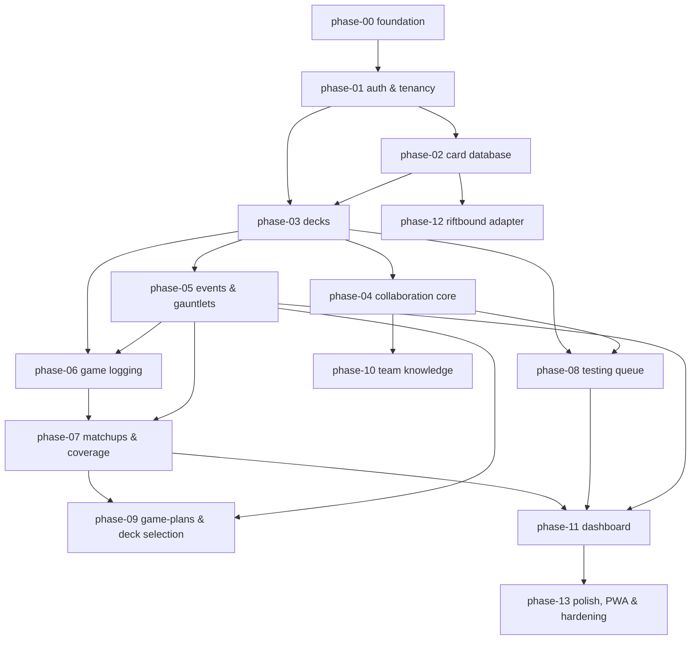

# Implementation Roadmap

TeamBrewer is built **one phase at a time, across multiple sessions**. Each phase is a self-contained unit
of work with its own goal, scope, dependencies, deliverables, task checklist, tests, and **verification**.
Use the [`implementing-a-phase`](../../.claude/skills/implementing-a-phase/SKILL.md) skill for every phase.

> **Read first:** the [knowledge base](../README.md), especially the feature spec(s) and ADR(s) a phase
> references. `docs/` is the source of truth.

## How to consume this roadmap

1. Pick the lowest-numbered **not-done** phase whose dependencies are all done.
2. Read its plan + referenced [features](../features/) + [ADRs](../decisions/) + [architecture](../architecture/).
3. Implement test-first, team-scoped, atomic commits.
4. Run the phase's verification; update the **Status** table below; keep docs in sync.

## Sequencing & dependencies

Collaboration Core (phase-04) is a **shared subsystem** (comments, mentions, activity, notifications) that
later modules attach to; it's built early and retrofitted onto decks.

## Phases

| # | Phase | Primary features | Depends on |
|---|---|---|---|
| 00 | [Foundation](phase-00-foundation.md) | monorepo, tooling, git, CI, Docker, Postgres, app skeletons | — |
| 01 | [Auth & Tenancy](phase-01-auth-and-tenancy.md) | accounts-and-auth, teams-and-membership | 00 |
| 02 | [Card Database](phase-02-card-database.md) | card-database | 01 |
| 03 | [Decks](phase-03-decks.md) | decks | 01, 02 |
| 04 | [Collaboration Core](phase-04-collaboration-core.md) | collaboration-core | 03 |
| 05 | [Events & Gauntlets](phase-05-events-and-gauntlets.md) | events-and-gauntlets | 03 |
| 06 | [Game Logging](phase-06-game-logging.md) | game-logging | 03, 05 |
| 07 | [Matchups & Coverage](phase-07-matchups-and-coverage.md) | confidence-and-matchups | 05, 06 |
| 08 | [Testing Queue](phase-08-testing-queue.md) | testing-queue | 03, 04 |
| 09 | [Game-Plans & Deck Selection](phase-09-gameplans-and-deck-selection.md) | gameplans-and-deck-selection | 05, 07 |
| 10 | [Team Knowledge](phase-10-team-knowledge.md) | team-knowledge | 04 |
| 11 | [Dashboard](phase-11-dashboard.md) | dashboard | 05, 07, 08 |
| 12 | [Riftbound Adapter](phase-12-riftbound-adapter.md) | (game-abstraction, card-database) | 02 |
| 13 | [Polish, PWA & Hardening](phase-13-polish-pwa-hardening.md) | cross-cutting | 11 |

## Status

Update as phases complete.

| # | Phase | Status |
|---|---|---|
| 00 | Foundation | ✅ done |
| 01 | Auth & Tenancy | ✅ done |
| 02 | Card Database | ✅ done |
| 03 | Decks | ✅ done |
| 04 | Collaboration Core | ✅ done |
| 05 | Events & Gauntlets | ✅ done |
| 06 | Game Logging | ✅ done |
| 07 | Matchups & Coverage | ✅ done |
| 08 | Testing Queue | ✅ done |
| 09 | Game-Plans & Deck Selection | ✅ done |
| 10 | Team Knowledge | ⛔ not started |
| 11 | Dashboard | ⛔ not started |
| 12 | Riftbound Adapter | ⛔ not started |
| 13 | Polish, PWA & Hardening | ⛔ not started |

Legend: ⛔ not started · 🚧 in progress · ✅ done
